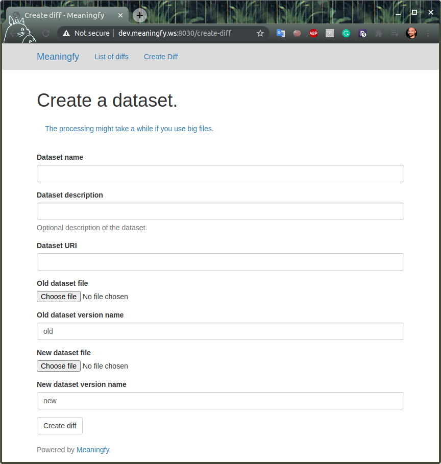
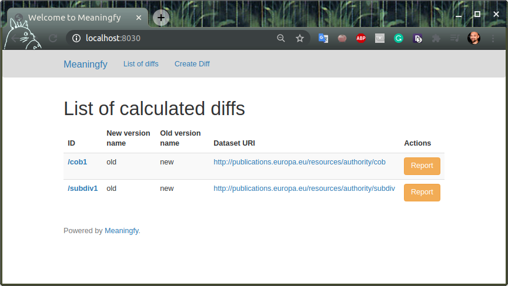

#  RDF Differ

A service for calculating the difference between versions of a given RDF dataset. Current implementation is based on the [skos-history tool](https://github.com/eu-vocabularies/skos-history).
See the [Wiki page of the original repository](https://github.com/jneubert/skos-history/wiki/Tutorial) for more technical details.


[](https://codecov.io/gh/eu-vocabularies/rdf-differ)

# Installation
RDF Differ uses fuseki (as the triplestore), celery (for multithreading programming), and redis (for pesistent storage).

Run the following commands to install all required dependencies on a **redhat** system

```bash
make install-os-dependencies
make install-python-dependencies
```

To run fuseki server (on first setup accept the default values): <br>
_leave this terminal session open_
```bash
make setup-fuseki
make run-local-fuseki
```

To set up redis server:
```bash
make setup-redis
```

Run api and celery:
```bash
make run-local-api
```

Run ui:
```bash
make run-local-ui
```

Stop api and ui servers:
```bash
make stop-gunicorn
```

If you are running the project for the first time this would be the commands run:
```bash
make install-os-dependencies
make install-python-dependencies
make setup-redis
make setup-fuseki
make run-api
make run-ui
```

In a separate terminal process run
```bash
make run-local-fuseki
```

### [this file](curl-examples.md) contains a list of examples on how to use the updated api

## Adding a new application profile template
The default application profile template is the diff report template that resides in [resources/templates/diff_report](resources/templates/diff_report) folder. 
For adding a new application profile create a new folder under [resources/templates](resources/templates) with the name
of your new application profile and following the structure explained below.

Folder structure needed for adding a new application profile:
```
templates 
│
└───diff_report
│   
└───new_application_profile
│   │
│   └───queries          <--- folder that contains SPARQL queries
│   │    │   query1.rq
│   │    │   query2.rq
│   │    │   ...
│   │    
│   └───template_variants
│       │
│       └───html        <--- folder that contains files needed for a html template
│       │
│       │  
│       └───json        <--- folder that contains files needed for a json template
```

###Html template variant

####Folder structure
```
html(folder) 
│
└─── config.json      <--- configuration file
│   
└───templates         <--- this is the folder that contains the jinja html templates
   │
   │  file1.html
   │  file2.html
   │  main.html

```
*Note* Make sure that in the templates folder there is a file named the same as the one defined in the config.json file
(i.e `    "template": "main.html"`)

####Template structure

The HTML template is built be combining four major parts as layout, main, macros and sections. The layout file (layout.html)
will have the rules of how the report will look like in terms of positioning and styling. Macros will contain all the 
jinja2 macros used across the template. A section represents the result of a query that was run with additional html and
will be used to build the report.
As the name suggest the main file of the html template is main.html. Here is where every other file that are a different 
section in the report are included and will form the HTML report. 

Example of including a section in the main html file

` `

Each section file has one or more variables where the SPARQL query result is saved 
as a pandas dataframe.

Example

`)`

*Note* The system has in place an autodiscover process for the SPARQL queries in the queries folder. Make sure that the file 
name added for the variable above (`"added_instance_concept.rq"`) exists in the queries folder.

####Adjusting an existing template
**Adding a new query/section**

To add a query a new file needs to be created and added into the queries folder as the system will autodiscover
this. After this is done a new html file that will represent a new section needs to be created. The content of this is 
similar to the existing ones and the only thing that needs to be adjusted will be the query file name in the content
variable definition as presented below:
```
)

```
As a final step, the created html file needs to be included in the report and to do this it has to be included in the 
main.html file by using the include block.

```
       --- relative path to the new html path
      
```


For adding a count query that will be used in the statistics 
section the steps are a bit different. First, will need to add the new query file following the naming conventions and 
adding the prefix count_ to the file name in queries folder. After this, the statistics.html will need to be modified as 
follows:

1. Create a new row in the existing table by using `<tr>` tag.
2. Create the necessary columns for the newly created row. Each row should have 7 values as this is the defined table 
structure (Property group, Property ,Added, Deleted, Updated, Moved, Changed) and each of them should be included by 
using a `<td>` tag if you are not using the block below to autogenerate this. 
```
    
    
    

    {{ mc.count_value(content) }}
    
```
*Note* The order of the cells is important. If you don't want to include a type of operation just create a `<td>` with a
desired value (i.e `<td>N/A</td>`). To avoid confusions, count queries should be added for all type of operations.
The example below will show how to add a complete row in the statistics section of the report
```
<tr>
    <td>Name of the property group</td>
    <td>Name of the property</td>
    --- this will bring the number generated from the SPARQL query for added occurences and will create the <td> tag
        
        
        

        {{ mc.count_value(content) }}
        
        
    --- this will bring the number generated from the SPARQL query for deleted occurences and will create the <td> tag
        
        
        

        {{ mc.count_value(content) }}
        
        
    --- this will bring the number generated from the SPARQL query for updated occurences and will create the <td> tag
        
        
        

        {{ mc.count_value(content) }}
        
        
    --- this will bring the number generated from the SPARQL query for moved occurences and will create the <td> tag
        
        
        

        {{ mc.count_value(content) }}
        
        
    --- this will bring the number generated from the SPARQL query for changed occurences and will create the <td> tag
        
        
        

        {{ mc.count_value(content) }}
        

</tr>
```
****Removing a query/section****

To remove a section from the existing report you just need to delete or comment the include statement from the main.html
file. If you decide to delete the include statement it's recommended to delete the query from the queries folder to avoid 
confusions later on.
```
      Include statement
            
```
To remove a row from the statistics section just delete or comment the `<tr>` bloc from the statistics.html file 
```
<tr>
    <td>Labels</td>
    <td>skos:prefLabel</td>
    
        
        
        

        {{ mc.count_value(content) }}
        
        
    
        
        
        

        {{ mc.count_value(content) }}
        
        
    
        
        
        

        {{ mc.count_value(content) }}
        
        
    
        
        
        

        {{ mc.count_value(content) }}
        
        
    
        
        
        

        {{ mc.count_value(content) }}
        
        
    
</tr>
```
###Json template variant
####Folder structure
```
json(folder) 
│
└─── config.json      <--- configuration file
│   
└───templates         <--- this is the folder that contains the jinja json templates
   │
   │  main.json

```
*Note* Make sure that in the templates folder there is a file named the same as the one defined in the config.json file
(i.e `    "template": "main.json"`)

####Template structure
The Json report is automatically built by running all queries that are found in the queries folder as the system has 
autodiscover process for this. In the beginning of this report there will be 3 keys that will show the metadata of the 
report like dataset used, created time and application profile used.  Each query result can be identified in the report 
by the filename and will contain a results key that will represent the result set brought back by the query
```
{
   --- Metadata
   
    "dataset_name": "name of dataset",
    "timestamp": "time",
    "application_profile": "application profile namme",
    
    --- Query result set
    
    "count_changed_property_concept_definition.rq":
    {
        "head":
        {
            "vars":
            [
                "entries"
            ]
        },
        "results":
        {
            "bindings":
            [
                {
                    "entries":
                    {
                        "datatype": "http://www.w3.org/2001/XMLSchema#integer",
                        "type": "literal",
                        "value": "0"
                    }
                }
            ]
        }
    }
}
```
####Adjusting an existing template
****Removing a query/section****
To remove a query result set from the report simply remove the query from the queries folder. 
*Note* Doing this will also affect the html template and it's recommended to ajust the html template, if this exists as
a template variant for the application profile that you are working with, following the 
instruction above to avoid errors when generating the hmtl template variant. 

# Usage


The diffing services are split into:

service | URL | info
------- | ------- | ----
`differ-api` | [localhost:4030](http://localhost:4030) | _access [localhost:4030/ui](http://localhost:4030/ui) for the swagger interface_ 
`differ-ui` | [localhost:8030](http://localhost:8030)

## Differ UI

> To create a new diff you can access [http://localhost:8030/create-diff](http://localhost:8030/create-diff)


> To list the existent diffs you can access [http://localhost:8030](http://localhost:8030/)



# Change type inventory

This section provides a change type inventory along with the patterns captured by each change type. We model the change as state transition operator between old (on the left) and teh new (on the right). The transition operator is denoted by the arrow symbol (-->). On each sides of the transition operator, we use a compact notation following SPARQL triple patterns. 

We use a set of conventions for each variable in the triple pattern, ascribing meaning to each of them and a few additional notations. These conventions are presented in teh table below.

| Notation                   | Meaning                                                                                                                                                    | Example                 |
|----------------------------|------------------------------------------------------------------------------------------------------------------------------------------------------------|-------------------------|
| triple pattern < _s p o_ >   | each item in the triple represents a SPARQL variable or an URI. For brevity we omit the question mark prefix (?) otherwise the SPARQL reading shall apply. | i p v                   |
| arrow (_ --> _)              | state transition operator (from one version to the next)                                                                                                   | i1 p o  -->  i2 p o     |
| _i_ - in the triple pattern  | the instance subject (assuming class instantiation)                                                                                                        | i p v                   |
| _p_ - in the triple pattern  | the main predicate                                                                                                                                         | i p v                   |
| _op_ - in the triple pattern | the secondary predicate in a property chain (/)                                                                                                            | i p/op v                |
| _v_ - in the triple pattern  | the value of interest, which is object of the main or secondary predicate                                                                                  | i p v                   |
| _@l_ - in the triple pattern | the language tag of the value, if any                                                                                                                      | v@l                     |
| slash (_/_)                  | the property chaining operation.                                                                                                                           | p1/p2/p3/p4             |
| number (_#_)                 | the numeric suffixes help distinguish variables of teh same type                                                                                           | i1 p1 o1  -->  i2 p2 o2 |
| zero (_0_)                   | denotes "empty set" or "not applicable"                                                                                                                    | 0                       |


The table below presents the patterns of change likely to occur in the context of maintaining SKOS vocabularies, but the abstraction proposed here may be useful way beyond this use case. The table represents a power product between the four types of change relevant to the current diffing context and the possible triple patterns in which they can occur. Cells that are marked with zero (0) mean that no check shall be performed for such a change type as it is included in onw of its siblings. The last two columns indicate whether quantification assumptions apply on either side of the transition operator.  

| change type / pattern    | instance  | property value free  | property value language dependent | reified property value    | property value langauge dependent | reification object | Left condition checking | Right condition checking |
|---------------------------|-----------|----------------------|-----------------------------------|---------------------------|-----------------------------------|--------------------|-------------------------|--------------------------|
| Addition                  | 0  -->  i | 0  -->  i p v        | 0 --> i p v@l                                | 0  -->  i p/op v          | 0                                 | 0                  |                       0 | x                        |
| Deletion                  | i  -->  0 | i p v  -->  0        | i p v@l  -->  0                   | i p/op v  -->  0          |                                   | 0                  | x                       |                        0 |
| Value update              | 0         | i p v1  -->  i p v2  | i p v1@l  -->  i p v2@l           | i p/op v1  -->  i p/op v2 | i p/op v1@l  -->  i p/op v2@l     | 0                  | x                       | x                        |
| Movement (cross instance) | 0         | i1 p v  -->  i2 p v  | 0                                 | i1 p/op v  -->  i2 p/op v | 0                                 | 0                  | x                       | x                        |
| Movement (cross property) | 0         | i p1 v  -->  i p2 v  | 0                                 | i p1/op v  -->  i p2/op v | 0                                 | 0                  | x                       | x                        |

The state transition patterns presented in the table above can be translated to SPARQL queries. The last two columns, referring to the quantification assumptions, are useful precisely for this purpose indicating what filters shall be used in the SPARQL query.  


Before we introduce the quantification assumptions, we need to mention that the current diffing is performed by subtracting teh new version of the dataset from the old one resulting in the set of deletions between the two and, conversely, subtracting the old version of the dataset from the new one resulting in a set of insertions between the two. Therefore we conceptualise four content graphs: _OldVersion_, _NewVersion_, _Insertions_ and _Deletions_. Below is the table that summarises the quantification assumptions as conditions that apply to either left or right side of the transition operator and involve one of the four graphs introduced here.  


| Conditions on the left side of the transition operator                                                                                                                              | Conditions on the right side of the transition operator                                                                                                                            |
|-------------------------------------------------------------------------------------------------------------------------------------------------------------------------------------|-------------------------------------------------------------------------------------------------------------------------------------------------------------------------------------|
| does NOT exist in the Insertion graph 				| exists in the Insertion graph 	|
| does NOT exist in the NewVersion graph [redundant]	| exists in the NewVersion graph [redundant]		|
| exists in the Deletions graph						| does NOT exist in the Deletions graph [redundant]		|
| exists in the OldVersion graph [redundant] 			| does NOT exist in the OldVersion graph 	|


# Contributing
You are more than welcome to help expand and mature this project. We adhere to [Apache code of conduct](https://www.apache.org/foundation/policies/conduct), please follow it in all your interactions on the project.   

When contributing to this repository, please first discuss the change you wish to make via issue, email, or any other method with the maintainers of this repository before making a change.

----
_Made with love by [Meaningfy](https://meaningfy.ws)._
