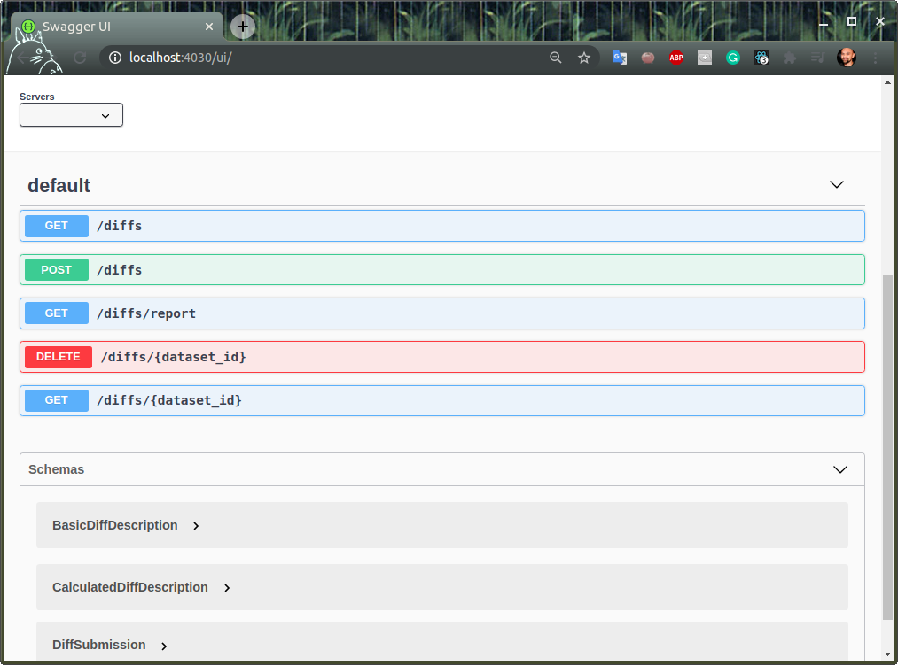

#  RDF Differ

A service for calculating the difference between versions of a given RDF dataset. Current implementation is based on the [skos-history tool](https://github.com/eu-vocabularies/skos-history).
See the [Wiki page of the original repository](https://github.com/jneubert/skos-history/wiki/Tutorial) for more technical details.


[](https://codecov.io/gh/eu-vocabularies/rdf-differ)

# Installation

Make sure that you are running `Docker` and have the correct permissions set. If not, run the following lines to install it. 

```bash
sudo apt -y install docker.io docker-compose

sudo groupadd docker
sudo usermod -aG docker $USER
newgrp docker
```

To build and the containers run:
```bash
make build
```

Install test/dev dependencies:

```bash
make install
```

To run the tests:
> Make sure that fuseki is running: `make fuseki-create-test-dbs`. (This command will create 2 dummy datasets.)
```bash
make fuseki-create-test-dbs
make test
```
## Configure diff report template 
The default diff report template resides in [resources/eds_templates/diff_report](resources/eds_templates/diff_report). 

To configure your own template you can copy the default report template and adjust it to your needs. Read more about the required structure of the template on the [eds4jinja2](https://github.com/meaningfy-ws/eds4jinja2) documentation page.
 
### Use the custom template
After you have your custom template, run the `make` command, indicating the location of your template through the `location` variable.
```bash
make location=<location to template> set-report-template
```
---
**NOTE**

Make sure that the location specified ends with a trailing slash `/`, otherwise the command will not work.

Example:
```bash
make location=~/template/location/ set-report-template
```
---
After this, restart the `rdf-differ-api` container for the effects to take place.

# Usage

## Start services
To run the docker containers for the `rdf-differ` `api` and `ui`, and `fuseki`:

```bash
make start-services
```

The diffing services are split into:

service | URL | info
------- | ------- | ----
`differ-api` | [localhost:4030](http://localhost:4030) | _access [localhost:4030/ui](http://localhost:4030/ui) for the swagger interface_ 
`differ-ui` | [localhost:8030](http://localhost:8030)

## Differ API

> Go to this link [localhost:4030/ui](http://localhost:4010/ui) to access the online definition of the API.


## Differ UI

> To create a new diff you can access [http://localhost:8030/create-diff](http://localhost:8030/create-diff)


> To list the existent diffs you can access [http://localhost:8030](http://localhost:8030/)


## Stop services
To stop the containers run:
```bash
make stop-services
```

## Performance estimates

Environment: AWS EC2 p2.medium and running the operations with Fuseki triple store.

* Calculating the diff for two versions of a large NAL (used Corporate Bodies) ~ 58s
* Generating the diff report for two versions of a large NAL (used Corporate Bodies)  ~  12 min

# Change type inventory

This section provides a change type inventory along with the patterns captured by each change type. We model the change as state transition operator between old (on the left) and teh new (on the right). The transition operator is denoted by the arrow symbol (-->). On each sides of the transition operator, we use a compact notation following SPARQL triple patterns. 

We use a set of conventions for each variable in the triple pattern, ascribing meaning to each of them and a few additional notations. These conventions are presented in teh table below.

| Notation                   | Meaning                                                                                                                                                    | Example                 |
|----------------------------|------------------------------------------------------------------------------------------------------------------------------------------------------------|-------------------------|
| triple pattern < _s p o_ >   | each item in the triple represents a SPARQL variable or an URI. For brevity we omit the question mark prefix (?) otherwise the SPARQL reading shall apply. | i p v                   |
| arrow (_ --> _)              | state transition operator (from one version to the next)                                                                                                   | i1 p o  -->  i2 p o     |
| _i_ - in the triple pattern  | the instance subject (assuming class instantiation)                                                                                                        | i p v                   |
| _p_ - in the triple pattern  | the main predicate                                                                                                                                         | i p v                   |
| _op_ - in the triple pattern | the secondary predicate in a property chain (/)                                                                                                            | i p/op v                |
| _v_ - in the triple pattern  | the value of interest, which is object of the main or secondary predicate                                                                                  | i p v                   |
| _@l_ - in the triple pattern | the language tag of the value, if any                                                                                                                      | v@l                     |
| slash (_/_)                  | the property chaining operation.                                                                                                                           | p1/p2/p3/p4             |
| number (_#_)                 | the numeric suffixes help distinguish variables of teh same type                                                                                           | i1 p1 o1  -->  i2 p2 o2 |
| zero (_0_)                   | denotes "empty set" or "not applicable"                                                                                                                    | 0                       |


The table below presents the patterns of change likely to occur in the context of maintaining SKOS vocabularies, but the abstraction proposed here may be useful way beyond this use case. The table represents a power product between the four types of change relevant to the current diffing context and the possible triple patterns in which they can occur. Cells that are marked with zero (0) mean that no check shall be performed for such a change type as it is included in onw of its siblings. The last two columns indicate whether quantification assumptions apply on either side of the transition operator.  

| change type / pattern    | instance  | property value free  | property value language dependent | reified property value    | property value langauge dependent | reification object | Left condition checking | Right condition checking |
|---------------------------|-----------|----------------------|-----------------------------------|---------------------------|-----------------------------------|--------------------|-------------------------|--------------------------|
| Addition                  | 0  -->  i | 0  -->  i p v        | 0 --> i p v@l                                | 0  -->  i p/op v          | 0                                 | 0                  |                       0 | x                        |
| Deletion                  | i  -->  0 | i p v  -->  0        | i p v@l  -->  0                   | i p/op v  -->  0          |                                   | 0                  | x                       |                        0 |
| Value update              | 0         | i p v1  -->  i p v2  | i p v1@l  -->  i p v2@l           | i p/op v1  -->  i p/op v2 | i p/op v1@l  -->  i p/op v2@l     | 0                  | x                       | x                        |
| Movement (cross instance) | 0         | i1 p v  -->  i2 p v  | 0                                 | i1 p/op v  -->  i2 p/op v | 0                                 | 0                  | x                       | x                        |
| Movement (cross property) | 0         | i p1 v  -->  i p2 v  | 0                                 | i p1/op v  -->  i p2/op v | 0                                 | 0                  | x                       | x                        |

The state transition patterns presented in the table above can be translated to SPARQL queries. The last two columns, referring to the quantification assumptions, are useful precisely for this purpose indicating what filters shall be used in the SPARQL query.  


Before we introduce the quantification assumptions, we need to mention that the current diffing is performed by subtracting teh new version of the dataset from the old one resulting in the set of deletions between the two and, conversely, subtracting the old version of the dataset from the new one resulting in a set of insertions between the two. Therefore we conceptualise four content graphs: _OldVersion_, _NewVersion_, _Insertions_ and _Deletions_. Below is the table that summarises the quantification assumptions as conditions that apply to either left or right side of the transition operator and involve one of the four graphs introduced here.  


| Conditions on the left side of the transition operator                                                                                                                              | Conditions on the right side of the transition operator                                                                                                                            |
|-------------------------------------------------------------------------------------------------------------------------------------------------------------------------------------|-------------------------------------------------------------------------------------------------------------------------------------------------------------------------------------|
| does NOT exist in the Insertion graph 				| exists in the Insertion graph 	|
| does NOT exist in the NewVersion graph [redundant]	| exists in the NewVersion graph [redundant]		|
| exists in the Deletions graph						| does NOT exist in the Deletions graph [redundant]		|
| exists in the OldVersion graph [redundant] 			| does NOT exist in the OldVersion graph 	|


# Contributing
You are more than welcome to help expand and mature this project. We adhere to [Apache code of conduct](https://www.apache.org/foundation/policies/conduct), please follow it in all your interactions on the project.   

When contributing to this repository, please first discuss the change you wish to make via issue, email, or any other method with the maintainers of this repository before making a change.

## Licence 
This project is licensed under [GNU GPLv3](https://www.gnu.org/licenses/gpl-3.0.en.html) licence. 

Powered by [Meaningfy](https://github.com/meaningfy-ws).
