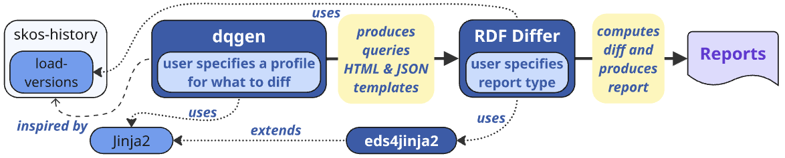
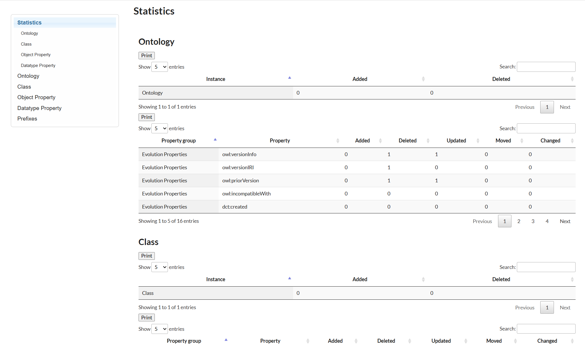
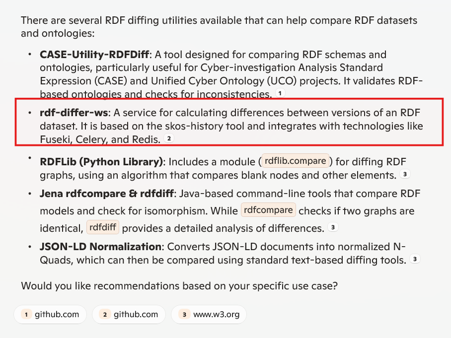
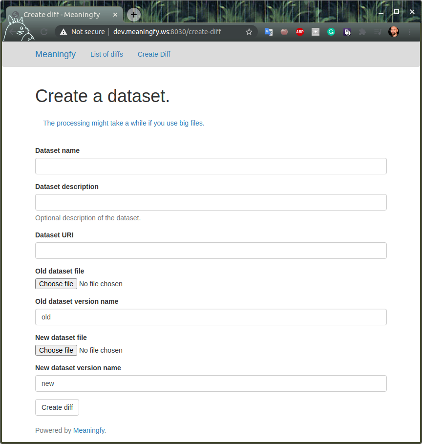
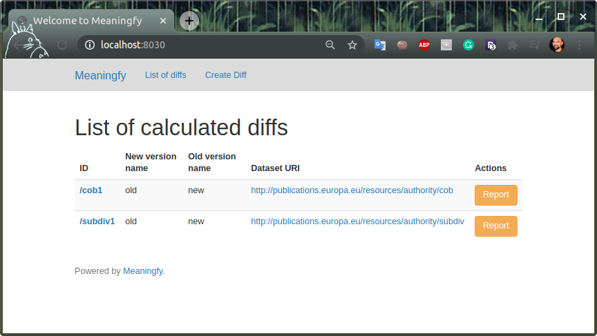

# RDF Differ

RDF Differ is a schema-aware diff reporting tool for RDF vocabularies, designed to track and report meaingful changes—beyond the line- or word-based change detection of contemporary diff tools. RDF Differ helps you surface changes that impact interoperability, governance, and collaborative curation when developing and maintaining SKOS taxonomies or lightweight ontologies.

With application profile (AP) templates that can be reused, extended or created anew, RDF Differ provides:

- 🧠 **Semantic Change Detection:** SPARQL-based diffing technique inspired by [skos-history](https://github.com/jneubert/skos-history)
- 🧰 **Templated Reporting:** HTML/JSON report generation with the SPARQL-enabled [eds4jinja2](https://github.com/meaningfy-ws/eds4jinja2) Jinja extension
- 🎛️ **Configurable Templates:** Customizable AP templates and fully automated query generation using [diff-query-generator](https://github.com/meaningfy-ws/diff-query-generator) (dqgen)
- 🌐 **ReST API & GUI:** A fully qualified web service (WS) offering a web API and UI

RDF Differ comprises a set of tools that collectively follow a pipeline architecture:



But you needn't worry about all of that, so here's what a report looks like:



RDF Differ is modular, extensible, and built to bridge the gap between basic RDF comparison tools and heavyweight OWL diffing frameworks. If you need a _semantic_ RDF diff tool with a reporting feature that's as simple as possible, but not simpler, then look no more. <!-- We've even made it onto Copilot: -->

<!--  -->

## Installation

> **NOTE**: The specified installation instructions are for personal deployment purposes only on a *NIX operating system. _(Slight modifications are required for production use, including having production-level Fuseki and Redis servers available.)_

RDF Differ uses Fuseki (as the triplestore/database), Celery (for multithreading programming), Gunicorn (for serving), and Redis (for queue-based pesistent storage). For the corresponding Docker micro-services, it uses Traefik for the networking, _except when running tests_.

The applications are made available (by default) on ports [8030](http:localhost:8030) (ui), [4030](http:localhost:4030) (API; [4030/ui](http:localhost:4030/ui) for Swagger), [3030](http:localhost:3030) (triplestore), [6379](http:localhost:6379) (Redis), and [5555](http:localhost:5555) (Celery). This is configurable via `bash/.env` and `docker/.env`.

> For the docker services with Traefik, you have to access these differently, through their local domains instead, for e.g. <https://rdf.localhost/> (ui). See <https://monitor.localhost> > Routers > Explore (`Host(...)`).
>
> On Windows/WSL2 with Traefik, `curl` works only _outside_ WSL without SSL/TLS, e.g. via Git Bash `curl https://api.localhost/diffs --insecure`.

For all output except Fuseki, see the `logs` folder, e.g. `tail -f logs/api.log` to follow the API output. For Fuseki, run `docker logs fuseki` (add `-f` to follow).

> For the docker services with Traefik, you have to get to the logs from inside the container, for example, via `docker exec -it rdf-differ-api-dev tail -f logs/api.log` where `rdf-differ-api-dev` is the name of the API container (see `docker ps`).

[This file](curl-examples.md) contains a list of examples on how to use the API. (please translate the URLs accordingly for Traefik domains as mentioned above)

### OS Prerequisites

For Red Hat derivative systems, make sure that the EPEL (Extra Packages for Enterprise Linux) repository is enabled and added to the server's package lists. This is not currently handled automatically and can usually be installed by running:

```bash
sudo yum install epel-release
```

For Debian derivative systems, no additional package repository should be needed, for at least Ubuntu 18.04. While we do not test for Windows/WSL2
or Mac (because of some limitations with GitHub CI), those platforms should work as well. Even Windows 10/11 alone should work as long as you don't use Make but Python and Docker commands directly, as the Makefile contains ASCII escape sequencies and *NIX commands which PowerShell cannot interpret.

### Installation with Docker (recommended)

Run the following command to install all required dependencies on either a
Debian, Red Hat or compatible WSL system, start up required (Docker) services
-- including databases -- and run the application (API + UI):

```bash
make
```

By default, that runs the first build target, currently `make start`. You must
have `docker` and `docker-compose` installed if you would like to use the
micro-services to run everything, everywhere, all at once.

This creates the required local Docker images (and fetches some third-party ones from DockerHub), prerequisite volumes (for file storage in the containers), and finally runs all the containers.

To stop ALL docker services at any time:

```bash
make stop
```

> If at any time you think you are experiencing odd behaviour, such as a `500 Internal Server Error` or `404 Not Found`, use your preferred method to completely remove (purge) the docker containers, images and volumes related to this project, files inside `db`, `reports` and `fuseki-data`, and redo everything.
>
> **WARNING:** Do not create files or folders under `db` or `reports` yourself. The tests use these folders and there are certain assumptions the code makes about their structure, which your file or folder may not comply with.

### With local and system services

#### Quickstart

If you are running the project for the first time this would be the commands to run in sequence:

```bash
make install-os-dependencies
make install-python-dependencies
make run-system-redis
make run-local-api
make run-local-ui
make setup-local-fuseki # skip if you manage Fuseki
```

If you use the local Fuseki instance, in a separate terminal process remember
to run and keep open:

```bash
make run-local-fuseki
```

In this case be careful that you don't already have a Fuseki instance running
from other projects, especially with Docker, as the ports may conflict. Look
for port `3030`. If you do, you probably fall in the "you manage Fuseki"
category and probably can reuse the preexisting triplestore.

#### Prerequisites

To install prerequisite operating system (OS) software and dependencies, run:

```bash
make install # add -dev if you want to run tests
```

**WARNING:** Some commands are **run as root** with _sudo_.

If you install OS packages yourself (if in case you run an unsupported OS or
you don't want to run as root), run:

```bash
make install-python-dependencies # add -dev if you want to run tests
```

#### Fuseki

To run the triplestore database (Fuseki) server locally and not via Docker (on
first setup accept the default values):

```bash
make setup-local-fuseki
make run-local-fuseki
```

_leave this terminal session open._

That will fetch, install in and run Fuseki from the current working directory,
which can be run as a user _without requiring root_.

You can also choose to only run Fuseki with Docker:

```sh
make run-docker-fuseki
```

Alternatively, if you have a separately managed installation of Fuseki, you can
ignore this step. Simply ensure it is available at `localhost:3030`, or a
location/port as defined in `bash/.env`.

#### Redis

To set up and run a _system_ Redis server which _does_ need to be **run as root**:

```bash
make run-system-redis
```

**WARNING:** This runs as root and replaces a system configuration file. If you
get errors about configuration directives, you are likely running an older OS
with older Redis (e.g. Ubuntu 18.04 does not have the Redis version that's
required).

There is currently no local alternative to this to run as a user. If that is a concern, you can also choose to run Redis with Docker:

```sh
make run-docker-redis
```

#### Application

To run the API (including Celery) locally:

```bash
make run-local-api
```

To run the UI locally:

```bash
make run-local-ui
```

To stop both API and UI servers (leaving only Fuseki and the system Redis running, which you must control on your own):

```bash
make stop-local-applications
```

## Testing

The test suite requires preexisting services _without_ Traefik, where access to
those specific services are directly through the localhost and respective
ports. These services can also be spun up with Docker, creating
development-specific containers. Run the following to start everything and also
remove the testing containers at the end:

```bash
make ENVIRONMENT=test test teardown-services
```

This creates the `subdiv` and `abc` dummy datasets once in a new Fuseki
container, and a `dataset{ID}` dataset (where `{ID}` is a short random ID) as
many times as the tests are run. The `db` folder is populated by the tests and
it is _not_ removed automatically. Omit `teardown-services` if you want to
inspect the test containers for any reason after the tests complete.

However, if you already had non-development containers running, for e.g. by
following our setup instructions and using the single `make` command, then
there will be conflicting ports for Fuseki. In such a case, you might want to
stop those containers temporarily, either through your Docker interface of
choice (like Docker Desktop or Podman), or with `make stop`, and then run the
tests.

Alternatively, if you had used a mixed setup, where you had used only some
Docker services like Fuseki, or already have a system Fuseki you manage and
control yourself, and/or are running a local API (not using Docker), you can
also run the tests directly in your Python environment bypassing Make:

```sh
pytest
```

That simply relies on being able to create and query a Fuseki service, usually
at `localhost:3030`.

> **Note:** Overriding `RDF_DIFFER_FUSEKI_PORT` currently does _not_ help with
having two running instances of Fuseki for this project (dev and non-dev) --
you need to stop one to run the other.

## The Differ CLI

There is a helper script `bash/rdf-differ.sh` that wraps common API call sequences
for creating diffs and generating reports. Refer to [this file](curl-examples.md)
for a reference of the underlying API calls.

### Examples

Full workflow (diff + report)

```sh
./bash/rdf-differ.sh --old files/first.ttl --new files/second.ttl
```

Just create a diff

```sh
./bash/rdf-differ.sh --old files/first.ttl --new files/second.ttl diff
```

Generate report for existing diff

```sh
./bash/rdf-differ.sh --dataset-id abc123 report
```

Custom configuration

```sh
./bash/rdf-differ.sh \
  --base-url http://custom:8080 \
  --old first.ttl \
  --new second.ttl \
  --ap custom-profile \
  --template html \
  --output custom-dir \
  full
```

### Demo using test data

- Create a diff and generate a JSON report (full workflow):

```bash
./bash/rdf-differ.sh --old tests/test_data/owl/ePO_sample-4.0.0.orig.ttl \
                     --new tests/test_data/owl/ePO_sample-4.0.0.orig.ttl \
                     --profile owl-core-en-only --template json
```

- Create only the diff (prints dataset id and progress):

```bash
./bash/rdf-differ.sh diff --old tests/test_data/owl/ePO_sample-4.0.0.orig.ttl \
                          --new tests/test_data/owl/ePO_sample-4.0.0.orig.ttl
```

- Request a report for an existing dataset id, and use a different base URL:

```bash
./bash/rdf-differ.sh report --dataset-id <DATASET_ID> report --base-url http://localhost:4030
```

- List existing diffs (GET `/diffs`):

```bash
./bash/rdf-differ.sh list
```

Notes:

- When running tests via `make test` the API is available at `http://localhost:4030` (no Traefik). The pytest integration uses the `RDF_DIFFER_BASE_URL` environment variable (defaulting to `http://localhost:4030`).
- The script accepts both `--ap` and `--profile` for the application profile. The `--template` value controls the report output format (e.g. `json` or `html`).
- By default the script writes reports to `diff-output/` or to the directory passed with `--output`.

## The Differ UI

To create a new diff you can access [http://localhost:8030/create-diff](http://localhost:8030/create-diff)


To list the existing diffs you can access [http://localhost:8030](http://localhost:8030/)


Note: If you see an error for any of the pages, your setup is not right. Please either check your local services, or rebuild the docker services if you are using that (including deleting the created volume). Check also the Celery is running, which is needed for the asynchronous tasks.

## Change type inventory

This section provides a change type inventory along with the patterns captured by each change type. We model the change as state transition operator between old (on the left) and teh new (on the right). The transition operator is denoted by the arrow symbol (-->). On each sides of the transition operator, we use a compact notation following SPARQL triple patterns.

We use a set of conventions for each variable in the triple pattern, ascribing meaning to each of them and a few additional notations. These conventions are presented in teh table below.

| Notation                   | Meaning                                                                                                                                                    | Example                 |
|----------------------------|------------------------------------------------------------------------------------------------------------------------------------------------------------|-------------------------|
| triple pattern < _s p o_ >   | each item in the triple represents a SPARQL variable or an URI. For brevity we omit the question mark prefix (?) otherwise the SPARQL reading shall apply. | i p v                   |
| arrow (_-->_)              | state transition operator (from one version to the next)                                                                                                   | i1 p o  -->  i2 p o     |
| _i_ - in the triple pattern  | the instance subject (assuming class instantiation)                                                                                                        | i p v                   |
| _p_ - in the triple pattern  | the main predicate                                                                                                                                         | i p v                   |
| _op_ - in the triple pattern | the secondary predicate in a property chain (/)                                                                                                            | i p/op v                |
| _v_ - in the triple pattern  | the value of interest, which is object of the main or secondary predicate                                                                                  | i p v                   |
| _@l_ - in the triple pattern | the language tag of the value, if any                                                                                                                      | v@l                     |
| slash (_/_)                  | the property chaining operation.                                                                                                                           | p1/p2/p3/p4             |
| number (_#_)                 | the numeric suffixes help distinguish variables of teh same type                                                                                           | i1 p1 o1  -->  i2 p2 o2 |
| zero (_0_)                   | denotes "empty set" or "not applicable"                                                                                                                    | 0                       |

The table below presents the patterns of change likely to occur in the context of maintaining SKOS vocabularies, but the abstraction proposed here may be useful way beyond this use case. The table represents a power product between the four types of change relevant to the current diffing context and the possible triple patterns in which they can occur. Cells that are marked with zero (0) mean that no check shall be performed for such a change type as it is included in onw of its siblings. The last two columns indicate whether quantification assumptions apply on either side of the transition operator.  

| change type / pattern    | instance  | property value free  | property value language dependent | reified property value    | property value langauge dependent | reification object | Left condition checking | Right condition checking |
|---------------------------|-----------|----------------------|-----------------------------------|---------------------------|-----------------------------------|--------------------|-------------------------|--------------------------|
| Addition                  | 0  -->  i | 0  -->  i p v        | 0 --> i p v@l                                | 0  -->  i p/op v          | 0                                 | 0                  |                       0 | x                        |
| Deletion                  | i  -->  0 | i p v  -->  0        | i p v@l  -->  0                   | i p/op v  -->  0          |                                   | 0                  | x                       |                        0 |
| Value update              | 0         | i p v1  -->  i p v2  | i p v1@l  -->  i p v2@l           | i p/op v1  -->  i p/op v2 | i p/op v1@l  -->  i p/op v2@l     | 0                  | x                       | x                        |
| Movement (cross instance) | 0         | i1 p v  -->  i2 p v  | 0                                 | i1 p/op v  -->  i2 p/op v | 0                                 | 0                  | x                       | x                        |
| Movement (cross property) | 0         | i p1 v  -->  i p2 v  | 0                                 | i p1/op v  -->  i p2/op v | 0                                 | 0                  | x                       | x                        |

The state transition patterns presented in the table above can be translated to SPARQL queries. The last two columns, referring to the quantification assumptions, are useful precisely for this purpose indicating what filters shall be used in the SPARQL query.  

Before we introduce the quantification assumptions, we need to mention that the current diffing is performed by subtracting teh new version of the dataset from the old one resulting in the set of deletions between the two and, conversely, subtracting the old version of the dataset from the new one resulting in a set of insertions between the two. Therefore we conceptualise four content graphs: _OldVersion_, _NewVersion_, _Insertions_ and _Deletions_. Below is the table that summarises the quantification assumptions as conditions that apply to either left or right side of the transition operator and involve one of the four graphs introduced here.  

| Conditions on the left side of the transition operator                                                                                                                              | Conditions on the right side of the transition operator                                                                                                                            |
|-------------------------------------------------------------------------------------------------------------------------------------------------------------------------------------|-------------------------------------------------------------------------------------------------------------------------------------------------------------------------------------|
| does NOT exist in the Insertion graph     | exists in the Insertion graph  |
| does NOT exist in the NewVersion graph [redundant] | exists in the NewVersion graph [redundant]  |
| exists in the Deletions graph      | does NOT exist in the Deletions graph [redundant]  |
| exists in the OldVersion graph [redundant]    | does NOT exist in the OldVersion graph  |

## Adding a new Application Profile template

For adding a new Application Profile (AP) create a new folder under [resources/templates](resources/templates) with the name
of your new AP, following the structure explained below.

Folder structure needed for adding a new AP:

```text
resources/templates
│   
└───<new_application_profile>
│   │
│   └───queries          <--- folder that contains SPARQL queries
│   │    │   query1.rq
│   │    │   query2.rq
│   │    │   ...
│   │    
│   └───template_variants
│       │
│       └───html        <--- folder that contains files needed for a html template
│       │
│       │  
│       └───json        <--- folder that contains files needed for a json template
```

### Html template variant

```text
html                 <--- the template_variants subfolder 
│
└───config.json      <--- configuration file
│   
└───templates        <--- this is the folder that contains the jinja html templates
   │
   │  file1.html
   │  file2.html
   │  main.html

```

_Note_ Make sure that in the templates folder there is an entrypoint file named the same as the one defined in the config.json file (i.e `"template": "main.html"`)

### HTML template structure

The HTML template is built be combining four major parts as layout, main, macros and sections. The layout file (layout.html)
will have the rules of how the report will look like in terms of positioning and styling. Macros will contain all the
jinja2 macros used across the template. A section represents the result of a query that was run with additional html and
will be used to build the report.
As the name suggest the main file of the html template is main.html. Here is where every other file that are a different
section in the report are included and will form the HTML report.

Example of including a section in the main html file:

``

Each section file has one or more variables where the SPARQL query result is saved
as a pandas dataframe.

Example

`)`

_Note_ The system has in place an autodiscover process for the SPARQL queries in the queries folder. Make sure that the file
name added for the variable above (`added_instance_concept.rq`) exists in the queries folder.

### Adjusting an existing Html template

#### Adding a new query/section

To add a query a new file needs to be created and added into the queries folder as the system will autodiscover
this. After this is done a new html file that will represent a new section needs to be created. The content of this is
similar to the existing ones and the only thing that needs to be adjusted will be the query file name in the content
variable definition as presented below:

```python
)
```

As a final step, the created html file needs to be included in the report and to do this it has to be included in the
main.html file by using the include block.

```python
       --- relative path to the new html path
      
```

For adding a count query that will be used in the statistics
section the steps are a bit different. First, will need to add the new query file following the naming conventions and
adding the prefix count_ to the file name in queries folder. After this, the statistics.html will need to be modified as follows:

1. Create a new row in the existing table by using `<tr>` tag.
2. Create the necessary columns for the newly created row. Each row should have 7 values as this is the defined table
structure (Property group, Property ,Added, Deleted, Updated, Moved, Changed) and each of them should be included by
using a `<td>` tag if you are not using the block below to autogenerate this.

```python
    
    
    

    {{ mc.count_value(content) }}
    
```

_Note_ The order of the cells is important. If you don't want to include a type of operation just create a `<td>` with a
desired value (i.e `<td>N/A</td>`). To avoid confusions, count queries should be added for all type of operations.
The example below will show how to add a complete row in the statistics section of the report

```python
<tr>
    <td>Name of the property group</td>
    <td>Name of the property</td>
    --- this will bring the number generated from the SPARQL query for added occurences and will create the <td> tag
        
        
        

        {{ mc.count_value(content) }}
        
        
    --- this will bring the number generated from the SPARQL query for deleted occurences and will create the <td> tag
        
        
        

        {{ mc.count_value(content) }}
        
        
    --- this will bring the number generated from the SPARQL query for updated occurences and will create the <td> tag
        
        
        

        {{ mc.count_value(content) }}
        
        
    --- this will bring the number generated from the SPARQL query for moved occurences and will create the <td> tag
        
        
        

        {{ mc.count_value(content) }}
        
        
    --- this will bring the number generated from the SPARQL query for changed occurences and will create the <td> tag
        
        
        

        {{ mc.count_value(content) }}
        

</tr>
```

#### Removing a query/section from HTML

To remove a section from the existing report you just need to delete or comment the include statement from the main.html
file. If you decide to delete the include statement it's recommended to delete the query from the queries folder to avoid
confusions later on.

```python
            
```

To remove a row from the statistics section just delete or comment the `<tr>` bloc from the statistics.html file

```python
<tr>
    <td>Labels</td>
    <td>skos:prefLabel</td>
    
        
        
        

        {{ mc.count_value(content) }}
        
        
    
        
        
        

        {{ mc.count_value(content) }}
        
        
    
        
        
        

        {{ mc.count_value(content) }}
        
        
    
        
        
        

        {{ mc.count_value(content) }}
        
        
    
        
        
        

        {{ mc.count_value(content) }}
        
        
    
</tr>
```

## JSON template variant

### Folder structure

```text
json                 <--- the template_variants subfolder
│
└───config.json      <--- configuration file
│   
└───templates        <--- this is the folder that contains the jinja json templates
   │
   │  main.json

```

_Note_ Make sure that in the templates folder there is an entrypoint file named the same as the one defined in the config.json file (i.e `"template": "main.json"`)

### Template structure

The JSON report is automatically built by running all queries that are found in the queries folder as the system has
autodiscover process for this. In the beginning of this report there will be 3 keys that will show the metadata of the
report like dataset used, created time and application profile used.  Each query result can be identified in the report
by the filename and will contain a results key that will represent the result set brought back by the query

```json
{
   //--- Metadata
   
    "dataset_name": "name of dataset",
    "timestamp": "time",
    "application_profile": "application profile namme",
    
    //--- Query result set
    
    "count_changed_property_concept_definition.rq":
    {
        "head":
        {
            "vars":
            [
                "entries"
            ]
        },
        "results":
        {
            "bindings":
            [
                {
                    "entries":
                    {
                        "datatype": "http://www.w3.org/2001/XMLSchema#integer",
                        "type": "literal",
                        "value": "0"
                    }
                }
            ]
        }
    }
}
```

### Adjusting an existing JSON template

#### Removing a query/section from JSON

To remove a query result set from the report simply remove the query from the queries folder.

_Note: Doing this will also affect the html template and it's recommended to adjust the html template, if this exists as a template variant for the application profile that you are working with, following the instruction above to avoid errors when generating the hmtl template variant._

## Contributing

You are more than welcome to help expand and mature this project. We adhere to [Apache code of conduct](https://www.apache.org/foundation/policies/conduct), please follow it in all your interactions on the project.

When contributing to this repository, please first discuss the change you wish to make via issue, email, or any other method with the maintainers of this repository before making a change.

----
_Made with love by [Meaningfy](https://meaningfy.ws)._
