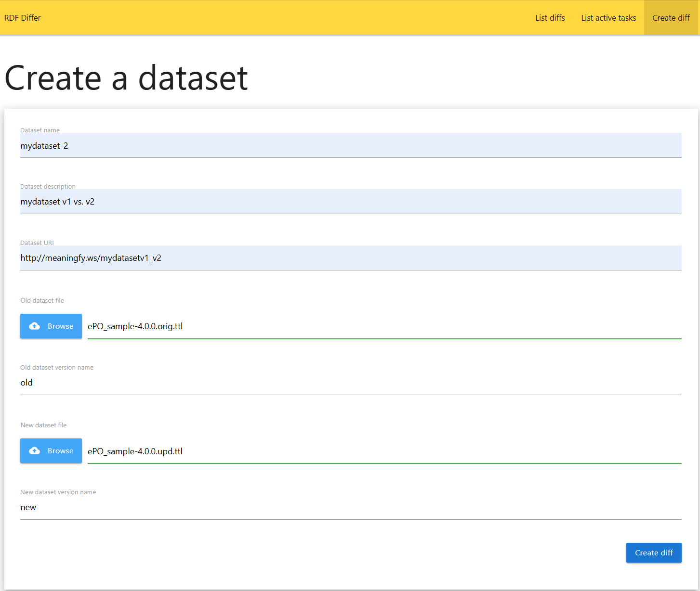
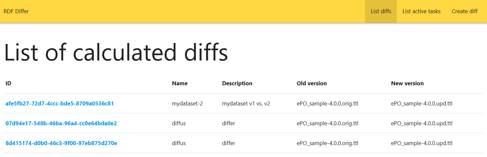
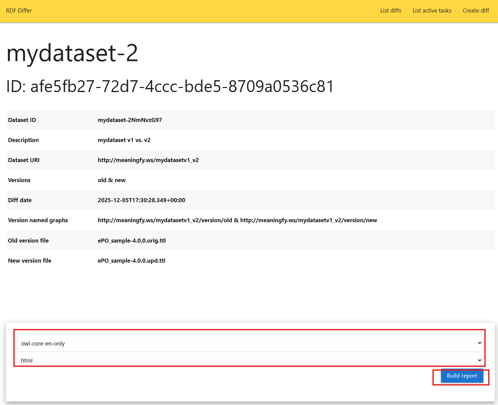
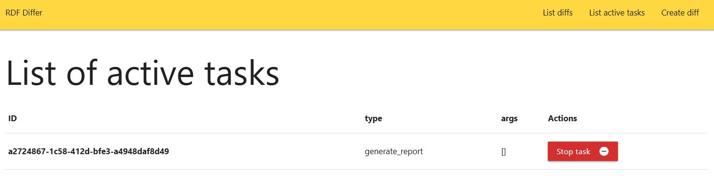
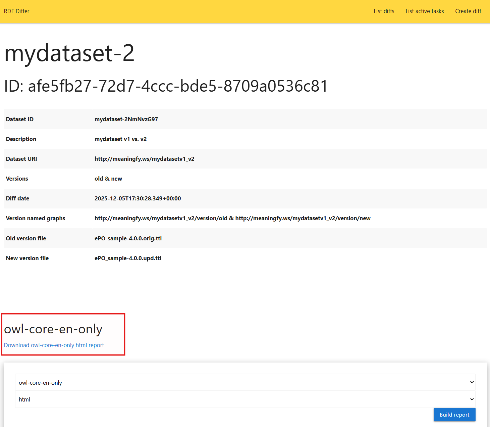
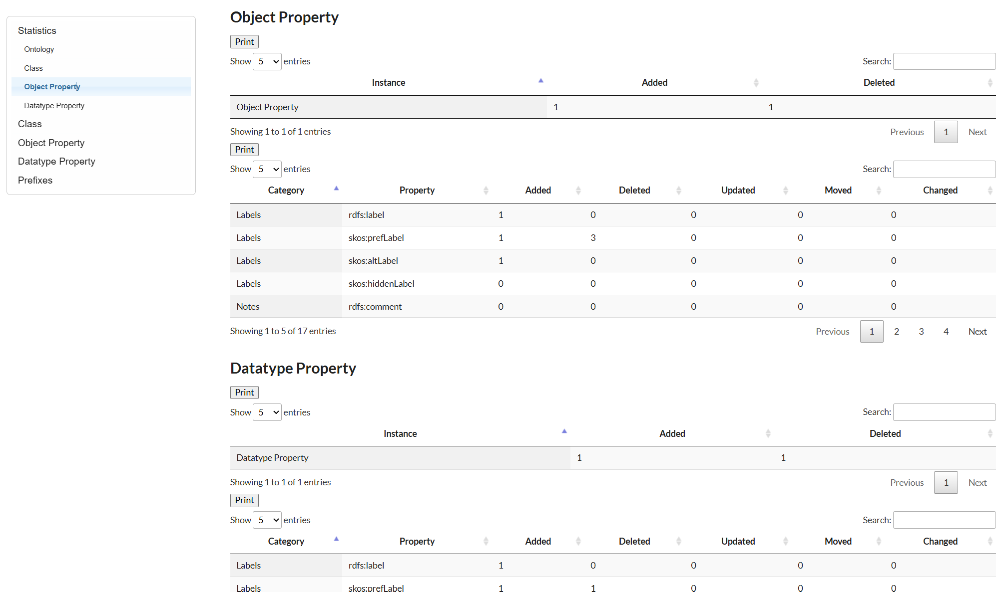
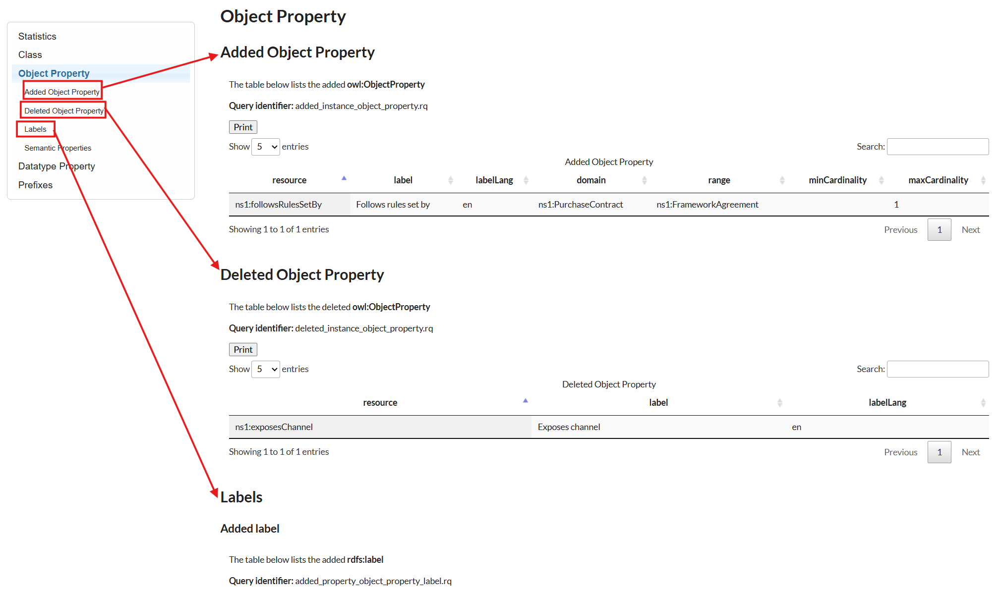
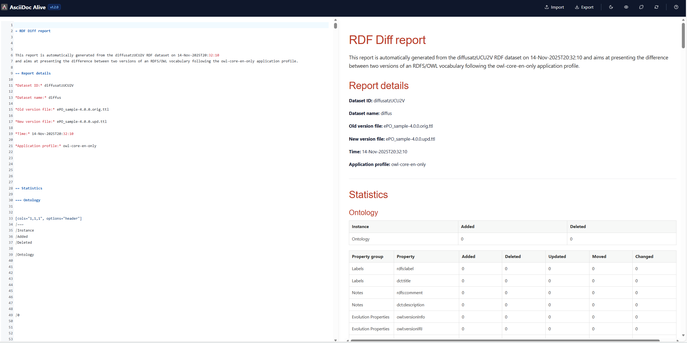

# RDF Differ

RDF Differ is a schema-aware diff reporting tool for RDF vocabularies, designed to track and report meaingful changes—beyond the line- or word-based change detection of contemporary diff tools. RDF Differ helps you surface changes that impact interoperability, governance, and collaborative curation when developing and maintaining SKOS taxonomies or lightweight ontologies.

With application profile (AP) templates that can be reused, extended or created anew, RDF Differ provides:

- 🧠 **Semantic Change Detection:** SPARQL-based diffing technique inspired by [skos-history](https://github.com/jneubert/skos-history)
- 🧰 **Templated Reporting:** HTML/JSON report generation with the SPARQL-enabled [eds4jinja2](https://github.com/meaningfy-ws/eds4jinja2) Jinja extension
- 🎛️ **Configurable Templates:** Customizable AP templates and fully automated query generation using [diff-query-generator](https://github.com/meaningfy-ws/diff-query-generator) (dqgen)
- 🌐 **ReST API, GUI & CLI:** A fully qualified web service (WS) offering a web API and UI, plus a CLI wrapper script

RDF Differ comprises a set of tools that collectively follow a pipeline architecture:


But you needn't worry about all of that, so here's what a report looks like (for you to decide if it's worth moving on to the usage and installation instructions):


RDF Differ is modular, extensible, and built to bridge the gap between basic RDF comparison tools and heavyweight OWL diffing frameworks. If you need a _semantic_ RDF diff tool with a reporting feature that's as simple as possible, but not simpler, then look no more. <!-- We've even made it onto Copilot: -->

<!--  -->

## Overview

RDF Differ can be used via a ReST API, web UI, or command-line interface (CLI). The API and UI can be run locally or via Docker containers, while the CLI scripts can interact with any running instance of the API.

The key concepts to be aware of when using RDF Differ are:

- **Diff:** The process of comparing two RDF datasets (old vs. new) to identify changes. But in the tool's context, "creating a diff" simply means loading both datasets into the triplestore and preparing them for change detection.
- **Report:** A structured summary of the identified changes, generated based on a specified application profile (AP) and template format (e.g. HTML). One can produce different reports from the same diff by varying the AP and template.
- **Application Profile (AP):** A predefined set of SPARQL queries and templates that define how to detect and report changes for specific RDF vocabularies or use cases.

### Change Types

The currently detected change types are:

- Added resource
- Deleted resource
- Updated (property value change)
- Moved (property with value moved from one resource to another)
- Changed (value moved from one property to another within the same resource)

The _updated_, _moved_ and _changed_ types are essentially details about "modified resources", but they are reported separately to provide more granular insights into the nature of the changes. Therefore, modifications are currently not reported for the resource as a whole (with statistics), but rather for each property that has changed.

For the theory and a more technical description of the change types, see the README at [dqgen](https://github.com/meaningfy-ws/diff-query-generator/), or read our [SEMANTiCS '25 paper](https://ceur-ws.org/Vol-4064/PD-paper9.pdf).

> The term "resource" and "instance" are used interchangeably in the rdf-differ suite of tools to refer to the RDF subjects of change detection, i.e. in the case of an OWL ontology, the entities with T-Box declarations of `a owl:Class`, `a owl:DatatypeProperty` or `a owl:ObjectProperty`. Not to be confused with instance in the OWL A-Box sense (i.e. "individuals" of the aforementioned).

### Application Profiles and Report Templates

RDF Differ uses application profiles (APs) to define how to detect and report changes for specific RDF vocabularies or use cases. Each AP consists of a set of SPARQL queries and templates that are used to generate the diff reports. The AP itself has its own template structure, which is defined in [dqgen](https://github.com/meaningfy-ws/diff-query-generator/blob/main/dqgen/resources/aps/).

The currently suppported APs are:

- [owl-core](https://github.com/meaningfy-ws/diff-query-generator/blob/main/dqgen/resources/aps/owl-core.csv)-en-only: For OWL ontologies with English labels
- [shacl-core](https://github.com/meaningfy-ws/diff-query-generator/blob/main/dqgen/resources/aps/shacl-core.csv)-en-only: For SHACL shapes with English labels
- [skos-core](https://github.com/meaningfy-ws/diff-query-generator/blob/main/dqgen/resources/aps/skos-core.csv)-en-only: For SKOS vocabularies with English labels

The language for labels matter for display purposes only. If you have another language, you will just miss the human-readable labels in the report, but the diffing will still work.

The currently supported report templates are:

- `JSON`: A machine-readable format (based on [SPARQL Query Results JSON Format](https://www.w3.org/TR/sparql12-results-json/))
- `HTML`: The world's standard Web markup format (styled with CSS and interactive JavaScript tables)
- `AsciiDoc`: A human-readable plain-text markup format (opens various conversion possibilities including HTML)

All AP templates can be edited or extended, and new ones can be created as needed. See the section on [Customizing RDF Differ](#customizing-rdf-differ) for more details. For modifications beyond a few lines or files, we recommend updating the existing meta-templates or introducing new ones in [dqgen](https://github.com/meaningfy-ws/diff-query-generator/tree/main/dqgen/resources), which is used to generate the queries and templates for RDF Differ, aside from defining the AP itself (in [CSV files](https://github.com/meaningfy-ws/diff-query-generator/tree/main/dqgen/resources/aps)).

### Embedded SHACL in OWL TTL files

There is special support in RDF Differ for handling OWL files (in RDF format, Turtle syntax) that have embedded SHACL shapes. This is to facilitate the retrieval of certain advanced information from the SHACL shapes, such as property domains, ranges and cardinalities, mainly for _added instances of properties_. This would otherwise not be doable with the current OWL-core profile, which is geared towards _lightweight_ ontologies that typically do not involve such expressions, or are not consistent in how they do so (whereas SHACL has a consistent pattern for these).

The following information is currently retrieved when reporting added instances of properties:

- Property domain(s) via `sh:targetClass`, represented as `domain` in the report
- Property range(s) via `sh:datatype`, `sh:class` and `sh:node/sh:property/sh:hasValue`, represented as `range` in the report
- Property cardinality constraints (min/max) via `sh:minCount` and `sh:maxCount`, represented as `minCardinality` and `maxCardinality` in the report

To reiterate, this information is only _retrieved_, i.e. there is no support for change detection of these properties or the constraints themselves. The purpose is to enrich the report with additional context about the added resources. And in order to exploit this feature, the SHACL shapes must be _embedded_ in the OWL file, i.e. both the OWL declarations and SHACL shapes must be present in the same RDF file. For usage instructions, refer to the [CLI section](#examples).

> **NOTE:** This is supported for only Turtle syntax files (`.ttl` extension) at the moment. If you have another format, use a tool like [riot](https://jena.apache.org/documentation/tools/#riot-and-related) to convert it to Turtle first.

## Installation

> The specified installation instructions are for personal deployment purposes only on a *NIX operating system. _(Slight modifications are required for production use, including having production-level Fuseki and Redis servers available.)_

RDF Differ uses Fuseki (as the triplestore/database), Celery (for multithreading programming), Gunicorn (for serving), and Redis (for queue-based pesistent storage). For the corresponding Docker micro-services, it uses Traefik for the networking, _except when running tests_.

The applications are made available (by default) on ports [8030](http:localhost:8030) (ui), [4030](http:localhost:4030) (API; [4030/ui](http:localhost:4030/ui) for Swagger), [3030](http:localhost:3030) (triplestore), [6379](http:localhost:6379) (Redis), and [5555](http:localhost:5555) (Celery). This is configurable via `infra/scripts/.env` and `infra/.env`.

> For the docker services with Traefik, you have to access these differently, through their local domains instead, for e.g. <https://rdf.localhost/> (ui). See <https://monitor.localhost> > Routers > Explore (`Host(...)`).
>
> On Windows/WSL2 with Traefik, `curl` works only _outside_ WSL without SSL/TLS, e.g. via Git Bash `curl https://api.localhost/diffs --insecure`.

For all output except Fuseki, see the `logs` folder, e.g. `tail -f logs/api.log` to follow the API output. For Fuseki, run `docker logs fuseki` (add `-f` to follow).

> For the docker services with Traefik, you have to get to the logs from inside the container, for example, via `docker exec -it rdf-differ-api-dev tail -f logs/api.log` where `rdf-differ-api-dev` is the name of the API container (see `docker ps`).

### OS Prerequisites

For Red Hat derivative systems, make sure that the EPEL (Extra Packages for Enterprise Linux) repository is enabled and added to the server's package lists. This is not currently handled automatically and can usually be installed by running:

```bash
sudo yum install epel-release
```

For Debian derivative systems, no additional package repository should be needed, for at least Ubuntu 18.04. While we do not test for Windows/WSL2
or Mac (because of some limitations with GitHub CI), those platforms should work as well. Even Windows 10/11 alone should work as long as you don't use Make but Python and Docker commands directly, as the Makefile contains ASCII escape sequencies and *NIX commands which PowerShell cannot interpret.

#### Optional dependencies

If you would like to run the `infra/scripts/merge-owl-shacl.sh` script for merging OWL and SHACL files to report embedded constraint information, you need to have Apache Jena's `riot` command-line tool installed.

Download [Jena](https://jena.apache.org/download/) to get access to its CLI tools (you will want to [put them in your `PATH`](https://jena.apache.org/documentation/tools/#common-issues-with-running-the-tools) to be able to run them as commands). If you are looking to integrate this into your GitHub CI/CD pipelines, you can also use a [third-party GitHub Action](https://github.com/marketplace/actions/setup-apache-jena).

### Installation with Docker (recommended)

Run the following command to install all required dependencies on either a
Debian, Red Hat or compatible WSL system, start up required (Docker) services
-- including databases -- and run the application (API + UI):

```bash
make
```

By default, that runs the first build target, currently `make start`. You must
have `docker` and `docker-compose` installed if you would like to use the
micro-services to run everything, everywhere, all at once.

This creates the required local Docker images (and fetches some third-party ones from DockerHub), prerequisite volumes (for file storage in the containers), and finally runs all the containers.

To stop ALL docker services at any time:

```bash
make stop
```

> If at any time you think you are experiencing odd behaviour, such as a `500 Internal Server Error` or `404 Not Found`, use your preferred method to completely remove (purge) the docker containers, images and volumes related to this project, files inside `db`, `reports`, `fuseki-data` and `logs` (sometimes file permissions can differ when switching between normal and testing environments and this can prevent startup), and redo everything.
>
> **WARNING:** Do not create files or folders under `db` or `reports` yourself. The tests use these folders and there are certain assumptions the code makes about their structure, which your file or folder may not comply with.

### With local and system services

If you are running the project for the first time this would be the commands to run in sequence:

```bash
make local-deps
make install
make local-redis
make local-api
make local-ui
make local-fuseki-setup # skip if you manage Fuseki
```

If you use the local Fuseki instance, in a separate terminal process remember
to run and keep open:

```bash
make local-fuseki
```

In this case be careful that you don't already have a Fuseki instance running
from other projects, especially with Docker, as the ports may conflict. Look
for port `3030`. If you do, you probably fall in the "you manage Fuseki"
category and probably can reuse the preexisting triplestore.

#### Prerequisites

Python dependencies install without root:

```bash
make install      # runtime only; add 'make install-dev' to run tests
```

The OS packages (Java for a local Fuseki, Redis) are **only** needed if you run
those services natively (not with Docker). They install with _sudo_:

```bash
make local-deps   # apt/yum install of Java + Redis (run as root)
```

If you run an unsupported OS, or prefer not to use root, install Java 11+ and
Redis 6+ yourself and skip `make local-deps`.

#### Fuseki

To run the triplestore database (Fuseki) server locally and not via Docker (on
first setup accept the default values):

```bash
make local-fuseki-setup
make local-fuseki
```

_leave this terminal session open._

That will fetch, install in and run Fuseki from the current working directory,
which can be run as a user _without requiring root_.

You can also bring up the dockerised test stack (which includes Fuseki) instead:

```sh
make start-services-test
```

Alternatively, if you have a separately managed installation of Fuseki, you can
ignore this step. Simply ensure it is available at `localhost:3030`, or a
location/port as defined in `infra/scripts/.env`.

#### Redis

To set up and run a _system_ Redis server which _does_ need to be **run as root**:

```bash
make local-redis
```

**WARNING:** This runs as root and replaces a system configuration file. If you
get errors about configuration directives, you are likely running an older OS
with older Redis (e.g. Ubuntu 18.04 does not have the Redis version that's
required).

There is currently no local alternative to this to run as a user. If that is a concern, bring up the dockerised test stack (which includes Redis) instead:

```sh
make start-services-test
```

#### Application

To run the API (including Celery) locally:

```bash
make local-api
```

To run the UI locally:

```bash
make local-ui
```

To stop both API and UI servers (leaving only Fuseki and the system Redis running, which you must control on your own):

```bash
make local-stop
```

## Usage

### The Differ CLI

For users who would rather not deal with the web UI, RDF Differ offers an HTTP ReST API. However, the API is _asynchronous_, meaning that calls are processed in the background, and one needs to _poll_ for the status of diff creation and report generation.

It is for this reason that we provide `infra/scripts/rdf-differ.sh`, a CLI helper script with a rudimentary but sufficient polling mechanism, to make it easier to use the tool from the command line. The script wraps common API call sequences for creating diffs and generating reports, with parameters for the AP and report template.

The supported AP values are:

- `owl-core-en-only`
- `shacl-core-en-only`
- `skos-core-en-only`

And the supported template format values are:

- `json`
- `html`
- `asciidoc`

In adddition, there is the `infra/scripts/merge-owl-shacl.sh` script that can be used to merge an OWL file and a SHACL file into a single OWL file. Merge both old and new files before passing the new "combined" file to the tool for diffing, and to report advanced constraint information from the embedded SHACL shapes.

#### Examples

Full workflow (diff + report using default OWL AP in default JSON format)

```sh
./infra/scripts/rdf-differ.sh --old <first-file> --new <second-file>
```

Create a diff only (this is useful to reuse the ID to generate reports in different templates/formats)

```sh
./infra/scripts/rdf-differ.sh diff --old <first-file> --new <second-file>
```

Generate report for an existing diff (using default OWL AP in default JSON format)

```sh
./infra/scripts/rdf-differ.sh report --dataset-id <diff-uid>
```

Custom configuration

```sh
./infra/scripts/rdf-differ.sh \
  --base-url http://<host>:<port> \
  --old <old-file> \
  --new <new-file> \
  --ap <desired-profile> \
  --template <desired-template> \
  --output custom-dir \
  full
```

Merge an OWL and SHACL file into a combined OWL file with embedded SHACL shapes:

```sh
./infra/scripts/merge-owl-shacl.sh [input-owl-file] [input-shacl-file] <output-combined-file>
```

Notes:

- When running tests via `make test` the API is available at `http://localhost:4030` (no Traefik). The pytest integration uses the `RDF_DIFFER_BASE_URL` environment variable (defaulting to `http://localhost:4030`).
- The script accepts both `--ap` and `--profile` for the application profile. The `--template` value controls the report output format (e.g. `json` or `html`).
- By default the script writes reports to `diff-output/` or to the directory passed with `--output`.
- The report file is saved as `diff.<template>`, e.g. `diff.json` or `diff.html`. This is _not_ configurable at the moment.

#### Demo using sample data

- Create a diff and generate a HTML report saved in `diff-output/` (full workflow):

```bash
./infra/scripts/rdf-differ.sh --old tests/test_data/owl/ePO_sample-4.0.0.orig.ttl \
                     --new tests/test_data/owl/ePO_sample-4.0.0.upd.ttl \
                     --profile owl-core-en-only --template HTML
```

- Create only the diff (prints `dataset_name` and `uid`, the latter of which is needed for report generation):

```bash
./infra/scripts/rdf-differ.sh diff --old tests/test_data/owl/ePO_sample-4.0.0.orig.ttl \
                          --new tests/test_data/owl/ePO_sample-4.0.0.upd.ttl
```

- Request a report for an existing dataset ID (`uid`), and use a different base URL:

```bash
./infra/scripts/rdf-differ.sh report --dataset-id 64000b53-61ac-4b34-8abd-5f77a4cfa453 report --base-url http://localhost:4030
```

- List existing diffs (GET `/diffs`):

```bash
./infra/scripts/rdf-differ.sh list
```

- Merge the OWL and SHACL artefacts of an actual lightweight ontology (ePO):

```sh
./infra/scripts/merge-owl-shacl.sh \
  evaluation/vocabularies/ePO_core-4.2.0.ttl \
  evaluation/vocabularies/ePO_core_shapes-4.2.0.ttl \
  evaluation/vocabularies/ePO_core_combined-4.2.0.ttl
```

#### API endpoint configuration

If you have a different setup, say some Docker services and some local services, check if the API itself is available at localhost:

```sh
curl localhost:4030/diffs
```

If so, you will need to override the base URL inclusive of the port:

```sh
./infra/scripts/rdf-differ.sh --old <first-file> --new <second-file> --base-url localhost:4030
```

In the development/production environment where services are running behind Traefik, no such override is required, as the default base URL for the script is `api.localhost`, the Traefik route for the API+port.

### The Differ UI

To create a new diff, click on **Create diff** and fill in all of the metadata fields along with uploading the old and new RDF files to diff.



To list existing diffs, click on **List diffs** and select a diff to view its details and generate reports.



To create reports, select an AP and report format from the two dropdowns, and then click on **Build report**.



To see running processes for diff creation and report generation, click on **List active tasks**.



Depending on the size of your data and number of items in your AP, this may take a while (a few mins for 500KB, considered relatively large for text files). You may refresh the page to see if the report is ready.

Once ready (the task has disappeared), navigate back to the diff, and a new section for the selected AP with a download link will have now appeared.



> **Note:** If you see an error for any of the pages, your setup is not right. Please either check your local services, or rebuild the Docker services if you are using that (including deleting the associated volumes). Check also that Celery is running, which is needed for the asynchronous tasks.

### The Differ API

Using the API directly is not expected to be a common use case. For advanced users or developers intending to integrate the differ, [this file](curl-examples.md) contains a list of examples on how to use the API. You will have to translate the URLs accordingly for Traefik domains as mentioned in the [installation instructions](#installation).

## The Diff Reports

RDF Differ generates diff reports in multiple formats based on the specified profile and template. The content of a report is dependent on the AP, which dictates what delta queries are involved, while the layout is dependent on the visual template (e.g. HTML, JSON or AsciiDoc), which dictates how information is presented.

### General Report Structure

In general, the APs and templates currently shipped with the tool by default follow a similar structure, which is mainly based around presenting a summary statistics, followed by detailed sections grouped by resource type, property category and change type. The layout can be understood to have four main components, as follows:

- **Summary Statistics:** An overview of the number of `Added` and `Deleted` resources, followed by the number of modified resources by property and change type. Sectioned by the resource type, with two tables per section, with the following columns:
  - **Category** the property group or category (e.g. `Labels`, `Notes`)
  - **Property** the property involved in the change of a resource (e.g. `rdfs:label`, `skos:prefLabel`)
  - **Added** the number of added instances of this property
  - **Deleted** the number of deleted instances of this property
  - **Updated** the number of updated instances of this property
  - **Moved** the number of instances of this property that moved from one resource to another
  - **Changed** the number of instances of this property that changed from one property to another within the same resource

- **Detailed Resource Sections:** The main body of the report, divided into sections by resource type (e.g. `Class`, `Object Property`, `Concept`).

- **Overview of Changed Resources:** For each resource type section, subsections for listing all `Added` and `Deleted` resources, followed by subsections listing modifications of those resources by category. The former two subsections have the following columns:
  - **resource** the name or URI of the added or deleted resource
  - **label** the human-readable label of the resource (if available)
  - **labelLang** the language of the label (if available)
  - For added properties with [embedded SHACL shapes](#embedded-shacl-in-owl-ttl-files), the following additional columns are included (empty if not applicable):
    - **domain** the domain of the property
    - **range** the range of the property
    - **minCardinality** the minimum cardinality constraint of the property
    - **maxCardinality** the maximum cardinality constraint of the property

- **Detailed Property Change Sections:** For each resource type section, and following the `Added` and `Deleted` subsections, further subsections presenting granular modifications on _properties of those resources_, grouped by the property category (e.g. `Labels`, `Notes`). Each subsection contains tables for each change type (`Added`, `Updated`, `Moved`, `Changed`), listing the affected resources and relevant details. The columns therefore vary by the change type, but generally include:
  - **resource** the name or URI of the modified resource
  - **label** the human-readable label of the resource (if available)
  - **labelLang** the language of the resource label (if available)
  - **property** the property involved in the change (representing the subsection)
  - **value** the value of the property
  - **valueLang** the language of the property value (if applicable)
  - For `Updated` changes, the following additional columns are included:
    - **oldValue** the previous value of the property
    - **oldValueLang** the language of the previous property value (if applicable)
    - **newValue** the new value of the property
    - **newValueLang** the language of the new property value (if applicable)
  - For `Moved` changes, the following additional columns are included:
    - **oldInstance** the resource from which the property value was moved
    - **newInstance** the resource to which the property value was moved
  - For `Changed` changes, the following additional columns are included:
    - **oldProperty** the previous property from which the value was changed
    - **newProperty** the new property to which the value was changed
- **Prefixe Section:** A list of all prefixes used in the report template for compact URIs. This list may _not_ contain prefixes in the vocabularies themselves -- only those defined in the template.

> Note: The column names of tables in the reports are only changeable through changing the SPARQL queries of the template, namely the `SELECT` variables.

### The HTML Report

The HTML report is the most user-friendly format, with interactive tables that allow for sorting, searching, and pagination. It is styled with CSS for better readability. See [evaluation/reports/rdf-differ-report_ePO_4.1-4.2_owl-core.html](evaluation/reports/rdf-differ-report_ePO_4.1-4.2_owl-core.html) for an example using the eProcurement ontology (ePO).

_Summary statistics view of a HTML report_


_Details view of a HTML report_


### The AsciiDoc Report

The AsciiDoc report is a plain-text format that is human-readable and can be converted to other formats (like HTML or PDF) using AsciiDoc tools. It follows the same structure as the HTML report but without the interactive features (so full tables are presented outright without paging). See [tests/test_data/owl/ePO_sample-4.0.0-upd_diff-report.adoc](tests/test_data/owl/ePO_sample-4.0.0-upd_diff-report.adoc) for an example using the eProcurement ontology (ePO).

Note that all markup, not unlike the HTML, is visible in the raw text and may contain a lot of undesireable white (empty) spaces and lines, mainly because of the underlying [Jinja](https://jinja.palletsprojects.com/en/stable/) (specifically [eds4jinja2](https://github.com/meaningfy-ws/eds4jinja2)) code. The HTML report would normally not be viewed directly, but rather in a web browser. Similarly, the AsciiDoc report is best viewed converted into a more user-friendly format using tools like [Antora](https://antora.org/), or by pasting the raw content into an online tool like [AsciiDoc Alive](https://asciidocalive.docswriter.com/).

_Preview of an AsciiDoc report on AsciiDoc Alive_


### The JSON Report

The JSON report is a machine-readable format suitable for programmatic consumption and further processing. At the root of the JSON object, keys represent the delta query file name, with the general naming scheme `{change-type}_{resource-type}[_modified-resource-type_property-name].rq`, where the part in square brackets only applies for modified resources, as follows:

- `{x}_instance_{y}.rq` where `x` is either `added` or `deleted`, for all `y` resource types defined in the AP, for e.g. `added_instance_class.rq` for added classes, `added_instance_datatype_property.rq` for added datatype resources, and so on.

- `{x}_property_{y}_{z}.rq` where `x` is one of `added`, `deleted`, `updated`, `moved` or `changed`, for all `y` resource types and `z` properties defined in the AP, for e.g. `updated_property_class_description.rq` for updated `dct:description` of any `owl:Class`, `moved_property_object_property_editorial_note.rq` for moved `skos:editorialNote` of any `owl:ObjectProperty`, and so on.

Within each of those keys, the value is an array of objects representing the results of the corresponding SPARQL query, with each object containing key-value pairs for the selected variables. This structure conforms to SPARQL JSON, with an initial `head` section defining the variables, followed by a `results` section containing the actual data under `bindings`.

Refer to the [SPARQL Query Results JSON Format](https://www.w3.org/TR/sparql12-results-json/) for more details, and follow the variable naming conventions as per the table columns described in the [General Report Structure](#general-report-structure) section for what keys to expect in the bindings.

In addition, there are the count variants of the above, with the same naming scheme but with a `count_` prefix, for e.g. `count_added_instance_class.rq` or `count_updated_property_class_description.rq`. Here the `bindings` contain a single `entries` result object/column with a `value` variable representing the number of results for the corresponding query.

See [tests/test_data/owl/ePO_sample-4.0.0-upd_diff-report.json](tests/test_data/owl/ePO_sample-4.0.0-upd_diff-report.json) for an example to follow along.

## Testing

The test suite requires preexisting services _without_ Traefik, where access to
those specific services are directly through the localhost and respective
ports. These services can also be spun up with Docker, creating
development-specific containers. Run the following to start everything and also
remove the testing containers at the end:

```bash
make ENVIRONMENT=test start-services-test # run separately to avoid race conditions
make ENVIRONMENT=test test teardown-services
```

This creates the `subdiv` and `abc` dummy datasets once in a new Fuseki
container, and a `dataset{ID}` dataset (where `{ID}` is a short random ID) as
many times as the tests are run. The `db` folder is populated by the tests and
it is _not_ removed automatically. Omit `teardown-services` if you want to
inspect the test containers for any reason after the tests complete.

However, if you already had non-development containers running, for e.g. by
following our setup instructions and using the single `make` command, then
there will be conflicting ports for Fuseki. In such a case, you might want to
stop those containers temporarily, either through your Docker interface of
choice (like Docker Desktop or Podman), or with `make stop`, and then run the
tests.

Alternatively, if you had used a mixed setup, where you had used only some
Docker services like Fuseki, or already have a system Fuseki you manage and
control yourself, and/or are running a local API (not using Docker), you can
also run the tests directly in your Python environment bypassing Make:

```sh
pytest
```

That simply relies on being able to create and query a Fuseki service, usually
at `localhost:3030`.

> **Note:** Overriding `RDF_DIFFER_FUSEKI_PORT` currently does _not_ help with
having two running instances of Fuseki for this project (dev and non-dev) --
you need to stop one to run the other.

## Customizing RDF Differ

One can customize the existing application profiles (APs) and report templates, or create new ones as needed. For customizing templates, see [docs/customize-templates](docs/customization/customize-templates.md).

While it is possible to customize the APs by modifying the queries, this is going to become very unwieldy once you realize there are as many queries to write or update, as there are change types and the number of resource types in your vocabulary. For this reason, while more straightfoward, customizing the report templates also becomes unmanageable once you go beyond a few lines.

It is therefore recommended to customize the source meta-templates or define new ones through [dqgen](https://github.com/meaningfy-ws/diff-query-generator/), after which you can generate and copy over the templates with simple `make` commands.

## Contributing

You are more than welcome to help expand and mature this project. We adhere to the [Apache Code of Conduct](https://www.apache.org/foundation/policies/conduct), please follow it in all your interactions on the project.

When contributing to this repository, you are welcome to fork and make a pull request, or discuss the change you wish to make via issue, email, or any other method with the maintainers of this repository.

----
_Made with love by [Meaningfy](https://meaningfy.ws)._
