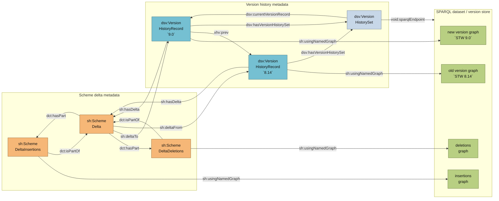

# Specification: Delta graphs for versioned SKOS/RDF vocabularies

## 1. Purpose and scope

This specification defines how delta graphs shall be used, computed, loaded, and exposed for versioned SKOS/RDF vocabularies. It is based on the `skos-history` pattern, where each complete vocabulary version is stored as a named graph, and each delta between two versions is stored as two additional named graphs: an insertions graph and a deletions graph.

The specification focuses on implementation in Python while remaining compatible with SPARQL 1.1 Graph Store Protocol and SPARQL Update. It also explains how the metadata graph shall describe versions, deltas, named graph descriptions, and the current version.

The intended implementation target is a SPARQL 1.1 compliant RDF store such as Apache Jena Fuseki, GraphDB, Virtuoso, or any server supporting graph upload and SPARQL Update.

## 2. Source resources

The following resources are relevant and should be treated as the baseline references for the design:

- https://github.com/jneubert/skos-history/wiki/Versions-and-Deltas-as-Named-Graphs
- https://github.com/jneubert/skos-history/wiki/List-of-Change-Categories
- https://afs.github.io/rdf-patch/
- https://vocab.org/vann/
- https://github.com/jneubert/skos-history/wiki/List-of-Use-Cases
- https://github.com/jneubert/skos-history/wiki/Tutorial
- https://github.com/jneubert/skos-history/blob/main/skos-history.ttl
- https://github.com/jneubert/skos-history/blob/main/bin/load_versions.sh

## 3. Conceptual model

The model separates four concerns:

1. Full version graphs: named graphs containing complete snapshots of a vocabulary version.
2. Delta graphs: named graphs containing triple-level differences between two versions.
3. Version history metadata: a graph describing version records, version order, deltas, named graph descriptions, and the current version.
4. Access metadata: SPARQL service and dataset description information that allows clients to discover the graphs.

A vocabulary version is not represented by overwriting a single graph. Instead, every version is preserved as its own immutable named graph. A new version is added as a new graph. The difference between an old and a new version is then computed and materialised as two graph resources:

- the deletions graph, containing triples present in the old version and absent from the new version;
- the insertions graph, containing triples present in the new version and absent from the old version.

Given an old graph `O` and a new graph `N`:

```text
insertions = N - O
deletions  = O - N
```

The delta from `O` to `N` is therefore not one graph, but a structured pair of named graphs. Applying the delta to `O` means deleting all triples in the deletions graph and adding all triples in the insertions graph.

## 4. Mermaid diagram



## 5. Required RDF resources

### 5.1 Version history set

The version history set represents the version history of one evolving vocabulary.

It shall be identified by a stable IRI, for example:

```text
{scheme_iri}/version
```

It shall be typed as:

```turtle
<.../version> a dsv:VersionHistorySet .
```

It shall identify the current version record:

```turtle
<.../version> dsv:currentVersionRecord <.../version/record/9.0> .
```

It should identify the SPARQL endpoint:

```turtle
<.../version> void:sparqlEndpoint <.../sparql> .
```

It may identify the scheme or vocabulary whose history it describes:

```turtle
<.../version> sh:isVersionHistoryOf <.../scheme> .
```

### 5.2 Version history record

Each version shall have one `dsv:VersionHistoryRecord`.

Example:

```turtle
<.../version/record/9.0>
    a dsv:VersionHistoryRecord ;
    dsv:hasVersionHistorySet <.../version> ;
    dc:identifier "9.0" ;
    dc:date "2025-01-01"^^xsd:date ;
    sh:usingNamedGraph <.../version/9.0/ng> .

<.../version/9.0/ng>
    a sd:NamedGraph ;
    sd:name <.../version/9.0> .
```

Important: `sh:usingNamedGraph` shall point to an `sd:NamedGraph` description resource. The actual graph IRI shall be obtained from `sd:name`.

### 5.3 Previous-version relation

For every version after the first one, the version history graph shall contain an `xhv:prev` relation from the newer version record to the immediately preceding version record.

Example:

```turtle
<.../version/record/9.0> xhv:prev <.../version/record/8.14> .
```

This relation defines the immediate version chain. It shall not be used for arbitrary older-version links.

### 5.4 Scheme delta

For every computed delta, the version history graph shall contain one `sh:SchemeDelta` resource.

Recommended IRI pattern:

```text
{version_history_iri}/{old_version}/delta/{new_version}
```

Example:

```turtle
<.../version/8.14/delta/9.0>
    a sh:SchemeDelta ;
    sh:deltaFrom <.../version/record/8.14> ;
    sh:deltaTo <.../version/record/9.0> ;
    dcterms:hasPart <.../version/8.14/delta/9.0/deletions> ;
    dcterms:hasPart <.../version/8.14/delta/9.0/insertions> .
```

The source and target records shall be distinct.

### 5.5 Delta components

A delta shall have exactly two operational components:

- one `sh:SchemeDeltaDeletions` component;
- one `sh:SchemeDeltaInsertions` component.

Example:

```turtle
<.../version/8.14/delta/9.0/deletions>
    a sh:SchemeDeltaDeletions ;
    dcterms:isPartOf <.../version/8.14/delta/9.0> ;
    sh:usingNamedGraph <.../version/8.14/delta/9.0/deletions/ng> .

<.../version/8.14/delta/9.0/deletions/ng>
    a sd:NamedGraph ;
    sd:name <.../version/8.14/delta/9.0/deletions> .

<.../version/8.14/delta/9.0/insertions>
    a sh:SchemeDeltaInsertions ;
    dcterms:isPartOf <.../version/8.14/delta/9.0> ;
    sh:usingNamedGraph <.../version/8.14/delta/9.0/insertions/ng> .

<.../version/8.14/delta/9.0/insertions/ng>
    a sd:NamedGraph ;
    sd:name <.../version/8.14/delta/9.0/insertions> .
```

### 5.6 Delta discoverability from version records

The delta should be discoverable from both participating version records:

```turtle
<.../version/record/8.14> sh:hasDelta <.../version/8.14/delta/9.0> .
<.../version/record/9.0>  sh:hasDelta <.../version/8.14/delta/9.0> .
```

However, application logic shall use `sh:deltaFrom` and `sh:deltaTo` as the authoritative direction of the delta.

## 6. Named graph layout

A conforming version store shall contain at least the following graphs:

| Graph role | Example graph IRI | Contents |
|---|---|---|
| Version history graph | `<.../version>` | Version records, delta metadata, named graph descriptions, current-version pointer |
| Old version graph | `<.../version/8.14>` | Full RDF snapshot of version 8.14 |
| New version graph | `<.../version/9.0>` | Full RDF snapshot of version 9.0 |
| Deletions graph | `<.../version/8.14/delta/9.0/deletions>` | Triples in 8.14 but not in 9.0 |
| Insertions graph | `<.../version/8.14/delta/9.0/insertions>` | Triples in 9.0 but not in 8.14 |
| Service description graph or default graph | implementation-specific | SPARQL service and named graph descriptions |

The version history graph shall be small and metadata-oriented. It shall not contain the full version content. Full content belongs in the version graphs. Computed differences belong in the delta graphs.

## 7. Delta computation rules

### 7.1 Basic rule

To compute a delta from version `old` to version `new`:

```text
deletions  = triples(old) - triples(new)
insertions = triples(new) - triples(old)
```

In SPARQL Update form:

```sparql
INSERT {
  GRAPH <DELTA_DELETIONS_GRAPH> {
    ?s ?p ?o
  }
}
WHERE {
  GRAPH <OLD_VERSION_GRAPH> {
    ?s ?p ?o
  }
  MINUS {
    GRAPH <NEW_VERSION_GRAPH> {
      ?s ?p ?o
    }
  }
}
```

```sparql
INSERT {
  GRAPH <DELTA_INSERTIONS_GRAPH> {
    ?s ?p ?o
  }
}
WHERE {
  GRAPH <NEW_VERSION_GRAPH> {
    ?s ?p ?o
  }
  MINUS {
    GRAPH <OLD_VERSION_GRAPH> {
      ?s ?p ?o
    }
  }
}
```

### 7.2 Blank node policy

The original `skos-history` loading script filters out blank nodes during delta computation. This is acceptable for SKOS vocabularies where blank nodes are not essential to the identity of concepts, labels, collections, and semantic relations.

Recommended default policy:

```sparql
FILTER isIRI(?s)
FILTER (isIRI(?o) || isLiteral(?o) || isNumeric(?o))
```

This means:

- subjects must be IRIs;
- objects may be IRIs, literals, or numerics;
- blank node subjects and blank node objects are excluded from delta graphs.

If the target vocabulary uses semantically important blank nodes, the implementation shall either:

1. skolemise blank nodes before loading versions; or
2. use an RDF Patch based approach that can preserve store-scoped blank node identity; or
3. explicitly document that blank-node-level changes are not tracked.

For most SKOS thesauri and controlled vocabularies, option 3 is often acceptable, but it must be a conscious design decision.

### 7.3 Canonical delta graph

A delta graph shall contain only effective changes.

A triple shall be present in the insertions graph only if it exists in the new version graph and does not exist in the old version graph.

A triple shall be present in the deletions graph only if it exists in the old version graph and does not exist in the new version graph.

No duplicate triples exist at the RDF graph level, so graph-level set semantics apply.

### 7.4 Consecutive and current-version deltas

The implementation shall compute deltas between every pair of consecutive versions.

Example:

```text
8.12 -> 8.13
8.13 -> 8.14
8.14 -> 9.0
```

The implementation may also compute direct deltas between older versions and the current version.

Example:

```text
8.12 -> 9.0
8.13 -> 9.0
8.14 -> 9.0
```

The consecutive delta chain is required for historical navigation. Direct-to-current deltas are optional but useful for clients that need to upgrade from any supported historical version to the latest version without traversing the chain.

## 8. Loading and computation process

The loading process shall be deterministic and repeatable. It should be implemented as an idempotent pipeline where re-running the process produces the same graph state, or replaces the same graph IRIs with equivalent content.

### 8.1 Inputs

The Python implementation shall accept a configuration object containing at least:

```yaml
dataset_id: stw
scheme_iri: https://example.org/stw
base_version_iri: https://example.org/stw/version
query_endpoint: https://example.org/sparql
update_endpoint: https://example.org/update
graph_store_endpoint: https://example.org/data
versions:
  - id: "8.14"
    file: "data/stw-8.14.ttl"
    date: "2024-01-01"
  - id: "9.0"
    file: "data/stw-9.0.ttl"
    date: "2025-01-01"
```

The `versions` list order shall define the chronological order.

### 8.2 URI construction

The implementation shall construct IRIs consistently.

Recommended patterns:

```text
Version history set:      {base_version_iri}
Version record:           {base_version_iri}/record/{version_id}
Version graph:            {base_version_iri}/{version_id}
Version named graph desc: {base_version_iri}/{version_id}/ng
Delta resource:           {base_version_iri}/{old_id}/delta/{new_id}
Deletions graph:          {base_version_iri}/{old_id}/delta/{new_id}/deletions
Insertions graph:         {base_version_iri}/{old_id}/delta/{new_id}/insertions
Delta graph desc:         {graph_iri}/ng
Service IRI:              {base_version_iri}/sparql-service
Service dataset IRI:      {base_version_iri}/sparql-service/dd
```

Version identifiers used in IRIs shall be URL-safe. If a version identifier contains spaces, slashes, or unsafe characters, the implementation shall percent-encode it or maintain a separate slug.

### 8.3 Process overview

The loading process shall execute these steps:

1. Validate configuration.
2. Prepare URI map.
3. Initialise service description metadata.
4. Initialise version history set metadata.
5. Load each full version file as a named graph.
6. Add metadata for each version record.
7. Add `xhv:prev` links between consecutive version records.
8. Compute delta graphs for each required pair.
9. Add metadata for each `sh:SchemeDelta` and its insertion/deletion components.
10. Add service description `sd:namedGraph` entries for all version and delta graphs.
11. Validate the resulting store structurally.
12. Optionally compute higher-level change reports from the delta graphs.

### 8.4 Step 1: Validate configuration

The implementation shall check:

- at least two versions are provided if deltas are to be computed;
- version identifiers are unique;
- files exist and are readable;
- endpoint URLs are present;
- `scheme_iri` and `base_version_iri` are absolute IRIs;
- version order is explicit and deterministic.

### 8.5 Step 2: Initialise service description metadata

The implementation should create a service description resource in a metadata graph or the default graph:

```sparql
PREFIX sd: <http://www.w3.org/ns/sparql-service-description#>
PREFIX dcterms: <http://purl.org/dc/terms/>

INSERT DATA {
  <SERVICE_IRI> a sd:Service ;
      sd:endpoint <QUERY_ENDPOINT> ;
      sd:defaultDataset <SERVICE_DATASET_IRI> .

  <SERVICE_DATASET_IRI> a sd:Dataset ;
      dcterms:title "Versioned vocabulary SPARQL service" .
}
```

### 8.6 Step 3: Initialise version history graph

The version history graph shall be created or replaced before loading metadata.

The current version is the last version in the configured version list.

```sparql
PREFIX dsv: <http://purl.org/iso25964/DataSet/Versioning#>
PREFIX sh: <http://purl.org/skos-history/>
PREFIX void: <http://rdfs.org/ns/void#>

INSERT DATA {
  GRAPH <VERSION_HISTORY_GRAPH> {
    <VERSION_HISTORY_GRAPH> a dsv:VersionHistorySet ;
        sh:isVersionHistoryOf <SCHEME_IRI> ;
        dsv:currentVersionRecord <CURRENT_VERSION_RECORD> ;
        void:sparqlEndpoint <QUERY_ENDPOINT> ;
        sh:usingNamedGraph <VERSION_HISTORY_GRAPH_DESC> .

    <VERSION_HISTORY_GRAPH_DESC>
        a sd:NamedGraph ;
        sd:name <VERSION_HISTORY_GRAPH> .
  }
}
```

### 8.7 Step 4: Load full version graphs

Each version file shall be uploaded to its version graph using the SPARQL Graph Store Protocol.

HTTP operation:

```http
PUT {graph_store_endpoint}?graph={version_graph_iri}
Content-Type: text/turtle

{file content}
```

Use `PUT`, not `POST`, if re-running the pipeline should replace the graph content.

The implementation shall ensure that RDF parsing errors stop the pipeline.

### 8.8 Step 5: Add version record metadata

For each loaded version, insert a version record in the version history graph:

```sparql
PREFIX dc: <http://purl.org/dc/elements/1.1/>
PREFIX dsv: <http://purl.org/iso25964/DataSet/Versioning#>
PREFIX sd: <http://www.w3.org/ns/sparql-service-description#>
PREFIX sh: <http://purl.org/skos-history/>
PREFIX xsd: <http://www.w3.org/2001/XMLSchema#>

INSERT DATA {
  GRAPH <VERSION_HISTORY_GRAPH> {
    <VERSION_RECORD> a dsv:VersionHistoryRecord ;
        dsv:hasVersionHistorySet <VERSION_HISTORY_GRAPH> ;
        dc:identifier "VERSION_ID" ;
        dc:date "VERSION_DATE"^^xsd:date ;
        sh:usingNamedGraph <VERSION_GRAPH_DESC> .

    <VERSION_GRAPH_DESC> a sd:NamedGraph ;
        sd:name <VERSION_GRAPH> .
  }
}
```

If `dc:identifier` and `dc:date` can be extracted reliably from the version graph, the implementation may compute them by querying the version graph. If not, they shall be taken from configuration.

### 8.9 Step 6: Add previous-version links

For every consecutive pair `(old, new)`, insert:

```sparql
PREFIX xhv: <http://www.w3.org/1999/xhtml/vocab#>

INSERT DATA {
  GRAPH <VERSION_HISTORY_GRAPH> {
    <NEW_VERSION_RECORD> xhv:prev <OLD_VERSION_RECORD> .
  }
}
```

There shall be no `xhv:prev` relation for the first version.

### 8.10 Step 7: Compute delta graphs

For every required pair `(old, new)`, compute two differences.

Deletions:

```sparql
INSERT {
  GRAPH <DELETIONS_GRAPH> {
    ?s ?p ?o
  }
}
WHERE {
  GRAPH <OLD_VERSION_GRAPH> {
    ?s ?p ?o
  }
  MINUS {
    GRAPH <NEW_VERSION_GRAPH> {
      ?s ?p ?o
    }
  }
  FILTER isIRI(?s)
  FILTER (isIRI(?o) || isLiteral(?o) || isNumeric(?o))
}
```

Insertions:

```sparql
INSERT {
  GRAPH <INSERTIONS_GRAPH> {
    ?s ?p ?o
  }
}
WHERE {
  GRAPH <NEW_VERSION_GRAPH> {
    ?s ?p ?o
  }
  MINUS {
    GRAPH <OLD_VERSION_GRAPH> {
      ?s ?p ?o
    }
  }
  FILTER isIRI(?s)
  FILTER (isIRI(?o) || isLiteral(?o) || isNumeric(?o))
}
```

Before computing a delta graph, the implementation should clear the target delta graph to avoid stale triples from previous runs:

```sparql
CLEAR GRAPH <DELETIONS_GRAPH> ;
CLEAR GRAPH <INSERTIONS_GRAPH> ;
```

If the SPARQL server does not accept multiple update operations in one request, send the `CLEAR GRAPH` operations separately.

### 8.11 Step 8: Add delta metadata

After computing the delta graphs, insert metadata in the version history graph:

```sparql
PREFIX dcterms: <http://purl.org/dc/terms/>
PREFIX sd: <http://www.w3.org/ns/sparql-service-description#>
PREFIX sh: <http://purl.org/skos-history/>

INSERT DATA {
  GRAPH <VERSION_HISTORY_GRAPH> {
    <OLD_VERSION_RECORD> sh:hasDelta <DELTA_RESOURCE> .
    <NEW_VERSION_RECORD> sh:hasDelta <DELTA_RESOURCE> .

    <DELTA_RESOURCE> a sh:SchemeDelta ;
        sh:deltaFrom <OLD_VERSION_RECORD> ;
        sh:deltaTo <NEW_VERSION_RECORD> ;
        dcterms:hasPart <DELETIONS_COMPONENT> ;
        dcterms:hasPart <INSERTIONS_COMPONENT> .

    <DELETIONS_COMPONENT> a sh:SchemeDeltaDeletions ;
        dcterms:isPartOf <DELTA_RESOURCE> ;
        sh:usingNamedGraph <DELETIONS_GRAPH_DESC> .

    <DELETIONS_GRAPH_DESC> a sd:NamedGraph ;
        sd:name <DELETIONS_GRAPH> .

    <INSERTIONS_COMPONENT> a sh:SchemeDeltaInsertions ;
        dcterms:isPartOf <DELTA_RESOURCE> ;
        sh:usingNamedGraph <INSERTIONS_GRAPH_DESC> .

    <INSERTIONS_GRAPH_DESC> a sd:NamedGraph ;
        sd:name <INSERTIONS_GRAPH> .
  }
}
```

### 8.12 Step 9: Register named graphs in the service description

For each version graph, delta graph, and the version history graph, add an `sd:namedGraph` entry:

```sparql
PREFIX sd: <http://www.w3.org/ns/sparql-service-description#>

INSERT DATA {
  <SERVICE_DATASET_IRI> sd:namedGraph <NAMED_GRAPH_DESC> .
  <NAMED_GRAPH_DESC> a sd:NamedGraph ;
      sd:name <GRAPH_IRI> .
}
```

This step improves discoverability but shall not be treated as a substitute for the version history graph. The version history graph is the authoritative graph for versioning metadata.

## 9. Python implementation specification

### 9.1 Recommended Python dependencies

The implementation should use:

- `rdflib` for local RDF parsing and optional local graph comparison;
- `requests` for HTTP communication with the SPARQL endpoints;
- `pydantic` or dataclasses for configuration validation;
- `pyyaml` for YAML configuration files;
- optionally `SPARQLWrapper` if preferred for query/update operations.

For large vocabularies, do not compute deltas locally with `rdflib` unless the graphs comfortably fit into memory. Prefer SPARQL-side computation using `MINUS` in the triple store.

### 9.2 Core Python API

The implementation should expose a service class with the following responsibilities:

```python
class VersionStoreLoader:
    def initialise_service_description(self) -> None: ...
    def initialise_version_history(self) -> None: ...
    def load_version_graphs(self) -> None: ...
    def insert_version_records(self) -> None: ...
    def insert_previous_links(self) -> None: ...
    def compute_delta(self, old_id: str, new_id: str) -> None: ...
    def compute_all_deltas(self) -> None: ...
    def validate_store(self) -> None: ...
    def run(self) -> None: ...
```

The class shall not hard-code dataset-specific identifiers. It shall derive graph IRIs and resource IRIs from configuration.

### 9.3 Configuration model

Example using dataclasses:

```python
from dataclasses import dataclass
from pathlib import Path
from typing import list

@dataclass(frozen=True)
class VersionSpec:
    id: str
    file: Path
    date: str | None = None

@dataclass(frozen=True)
class VersionStoreConfig:
    dataset_id: str
    scheme_iri: str
    base_version_iri: str
    query_endpoint: str
    update_endpoint: str
    graph_store_endpoint: str
    versions: list[VersionSpec]
    compute_direct_to_current: bool = True
    content_type: str = "text/turtle"
```

### 9.4 URI builder

```python
from urllib.parse import quote

class UriBuilder:
    def __init__(self, base_version_iri: str):
        self.base = base_version_iri.rstrip("/")

    def slug(self, version_id: str) -> str:
        return quote(version_id, safe="")

    def history_graph(self) -> str:
        return self.base

    def version_record(self, version_id: str) -> str:
        return f"{self.base}/record/{self.slug(version_id)}"

    def version_graph(self, version_id: str) -> str:
        return f"{self.base}/{self.slug(version_id)}"

    def version_graph_desc(self, version_id: str) -> str:
        return f"{self.version_graph(version_id)}/ng"

    def delta(self, old_id: str, new_id: str) -> str:
        return f"{self.base}/{self.slug(old_id)}/delta/{self.slug(new_id)}"

    def delta_graph(self, old_id: str, new_id: str, operation: str) -> str:
        assert operation in {"insertions", "deletions"}
        return f"{self.delta(old_id, new_id)}/{operation}"

    def delta_graph_desc(self, old_id: str, new_id: str, operation: str) -> str:
        return f"{self.delta_graph(old_id, new_id, operation)}/ng"

    def service_iri(self) -> str:
        return f"{self.base}/sparql-service"

    def service_dataset_iri(self) -> str:
        return f"{self.base}/sparql-service/dd"
```

### 9.5 HTTP functions

```python
import requests

class SparqlClient:
    def __init__(self, query_endpoint: str, update_endpoint: str, graph_store_endpoint: str):
        self.query_endpoint = query_endpoint
        self.update_endpoint = update_endpoint
        self.graph_store_endpoint = graph_store_endpoint

    def update(self, sparql: str) -> None:
        response = requests.post(
            self.update_endpoint,
            data={"update": sparql},
            headers={"Accept": "application/sparql-results+json"},
            timeout=120,
        )
        response.raise_for_status()

    def put_graph(self, graph_iri: str, file_path: str, content_type: str = "text/turtle") -> None:
        with open(file_path, "rb") as file:
            response = requests.put(
                self.graph_store_endpoint,
                params={"graph": graph_iri},
                data=file,
                headers={"Content-Type": content_type},
                timeout=300,
            )
        response.raise_for_status()

    def query(self, sparql: str) -> dict:
        response = requests.get(
            self.query_endpoint,
            params={"query": sparql},
            headers={"Accept": "application/sparql-results+json"},
            timeout=120,
        )
        response.raise_for_status()
        return response.json()
```

### 9.6 Delta computation in Python through SPARQL Update

```python
def compute_delta(client: SparqlClient, uris: UriBuilder, old_id: str, new_id: str) -> None:
    old_graph = uris.version_graph(old_id)
    new_graph = uris.version_graph(new_id)
    deletions_graph = uris.delta_graph(old_id, new_id, "deletions")
    insertions_graph = uris.delta_graph(old_id, new_id, "insertions")

    client.update(f"CLEAR GRAPH <{deletions_graph}>")
    client.update(f"CLEAR GRAPH <{insertions_graph}>")

    client.update(f"""
        INSERT {{
          GRAPH <{deletions_graph}> {{
            ?s ?p ?o
          }}
        }}
        WHERE {{
          GRAPH <{old_graph}> {{
            ?s ?p ?o
          }}
          MINUS {{
            GRAPH <{new_graph}> {{
              ?s ?p ?o
            }}
          }}
          FILTER isIRI(?s)
          FILTER (isIRI(?o) || isLiteral(?o) || isNumeric(?o))
        }}
    """)

    client.update(f"""
        INSERT {{
          GRAPH <{insertions_graph}> {{
            ?s ?p ?o
          }}
        }}
        WHERE {{
          GRAPH <{new_graph}> {{
            ?s ?p ?o
          }}
          MINUS {{
            GRAPH <{old_graph}> {{
              ?s ?p ?o
            }}
          }}
          FILTER isIRI(?s)
          FILTER (isIRI(?o) || isLiteral(?o) || isNumeric(?o))
        }}
    """)
```

### 9.7 Insert delta metadata in Python

```python
def insert_delta_metadata(client: SparqlClient, uris: UriBuilder, old_id: str, new_id: str) -> None:
    history_graph = uris.history_graph()
    delta = uris.delta(old_id, new_id)

    old_record = uris.version_record(old_id)
    new_record = uris.version_record(new_id)

    deletions_component = uris.delta_graph(old_id, new_id, "deletions")
    insertions_component = uris.delta_graph(old_id, new_id, "insertions")

    deletions_desc = uris.delta_graph_desc(old_id, new_id, "deletions")
    insertions_desc = uris.delta_graph_desc(old_id, new_id, "insertions")

    deletions_graph = uris.delta_graph(old_id, new_id, "deletions")
    insertions_graph = uris.delta_graph(old_id, new_id, "insertions")

    client.update(f"""
        PREFIX dcterms: <http://purl.org/dc/terms/>
        PREFIX sd: <http://www.w3.org/ns/sparql-service-description#>
        PREFIX sh: <http://purl.org/skos-history/>

        INSERT DATA {{
          GRAPH <{history_graph}> {{
            <{old_record}> sh:hasDelta <{delta}> .
            <{new_record}> sh:hasDelta <{delta}> .

            <{delta}> a sh:SchemeDelta ;
                sh:deltaFrom <{old_record}> ;
                sh:deltaTo <{new_record}> ;
                dcterms:hasPart <{deletions_component}> ;
                dcterms:hasPart <{insertions_component}> .

            <{deletions_component}> a sh:SchemeDeltaDeletions ;
                dcterms:isPartOf <{delta}> ;
                sh:usingNamedGraph <{deletions_desc}> .

            <{deletions_desc}> a sd:NamedGraph ;
                sd:name <{deletions_graph}> .

            <{insertions_component}> a sh:SchemeDeltaInsertions ;
                dcterms:isPartOf <{delta}> ;
                sh:usingNamedGraph <{insertions_desc}> .

            <{insertions_desc}> a sd:NamedGraph ;
                sd:name <{insertions_graph}> .
          }}
        }}
    """)
```

### 9.8 Compute all delta pairs

```python
def consecutive_pairs(version_ids: list[str]) -> list[tuple[str, str]]:
    return list(zip(version_ids, version_ids[1:]))


def direct_to_current_pairs(version_ids: list[str]) -> list[tuple[str, str]]:
    current = version_ids[-1]
    penultimate = version_ids[-2] if len(version_ids) >= 2 else None
    return [
        (old, current)
        for old in version_ids[:-1]
        if old != penultimate
    ]


def all_delta_pairs(version_ids: list[str], compute_direct_to_current: bool = True) -> list[tuple[str, str]]:
    pairs = consecutive_pairs(version_ids)
    if compute_direct_to_current and len(version_ids) > 2:
        pairs.extend(direct_to_current_pairs(version_ids))
    return pairs
```

This mirrors the `skos-history` loading behaviour: compute deltas between consecutive versions and, optionally, deltas between older versions and the latest version.

## 10. Validation checks

A conforming implementation should validate the resulting store after loading.

### 10.1 Version history set checks

Required checks:

- exactly one `dsv:VersionHistorySet` for the configured version history graph;
- exactly one `dsv:currentVersionRecord`;
- current version record equals the last configured version;
- `void:sparqlEndpoint` is present;
- `sh:usingNamedGraph / sd:name` resolves to the version history graph.

### 10.2 Version record checks

For each configured version:

- one `dsv:VersionHistoryRecord` exists;
- it has `dsv:hasVersionHistorySet` pointing to the version history set;
- it has `dc:identifier`;
- it has `sh:usingNamedGraph / sd:name` pointing to the correct version graph;
- the version graph exists and is non-empty.

### 10.3 Version chain checks

For every consecutive pair `(old, new)`:

- the new version record has `xhv:prev` pointing to the old version record;
- the old and new records are distinct.

### 10.4 Delta metadata checks

For every computed delta pair `(old, new)`:

- one `sh:SchemeDelta` exists;
- it has `sh:deltaFrom` old record;
- it has `sh:deltaTo` new record;
- it has one `sh:SchemeDeltaDeletions` part;
- it has one `sh:SchemeDeltaInsertions` part;
- each part has `sh:usingNamedGraph / sd:name` pointing to the expected delta graph.

### 10.5 Delta content checks

For each delta pair:

- each triple in the insertions graph exists in the new graph;
- each triple in the insertions graph does not exist in the old graph;
- each triple in the deletions graph exists in the old graph;
- each triple in the deletions graph does not exist in the new graph.

These checks can be implemented using SPARQL `ASK` queries.

Example: invalid insertion triples:

```sparql
ASK {
  GRAPH <INSERTIONS_GRAPH> { ?s ?p ?o }
  FILTER NOT EXISTS {
    GRAPH <NEW_VERSION_GRAPH> { ?s ?p ?o }
  }
}
```

If this query returns `true`, the insertions graph is invalid.

Example: insertion triples that already existed in the old version:

```sparql
ASK {
  GRAPH <INSERTIONS_GRAPH> { ?s ?p ?o }
  GRAPH <OLD_VERSION_GRAPH> { ?s ?p ?o }
}
```

If this query returns `true`, the insertions graph contains non-effective changes.

## 11. Querying the delta graphs

### 11.1 Retrieve the current version graph

```sparql
PREFIX dsv: <http://purl.org/iso25964/DataSet/Versioning#>
PREFIX sd: <http://www.w3.org/ns/sparql-service-description#>
PREFIX sh: <http://purl.org/skos-history/>

SELECT ?currentRecord ?currentGraph
WHERE {
  GRAPH <VERSION_HISTORY_GRAPH> {
    <VERSION_HISTORY_GRAPH> dsv:currentVersionRecord ?currentRecord .
    ?currentRecord sh:usingNamedGraph / sd:name ?currentGraph .
  }
}
```

### 11.2 Retrieve the current delta graphs

```sparql
PREFIX dcterms: <http://purl.org/dc/terms/>
PREFIX dsv: <http://purl.org/iso25964/DataSet/Versioning#>
PREFIX sd: <http://www.w3.org/ns/sparql-service-description#>
PREFIX sh: <http://purl.org/skos-history/>
PREFIX xhv: <http://www.w3.org/1999/xhtml/vocab#>

SELECT ?previousRecord ?currentRecord ?insertionsGraph ?deletionsGraph
WHERE {
  GRAPH <VERSION_HISTORY_GRAPH> {
    <VERSION_HISTORY_GRAPH> dsv:currentVersionRecord ?currentRecord .
    ?currentRecord xhv:prev ?previousRecord .

    ?delta sh:deltaFrom ?previousRecord ;
           sh:deltaTo ?currentRecord ;
           dcterms:hasPart ?insertions ;
           dcterms:hasPart ?deletions .

    ?insertions a sh:SchemeDeltaInsertions ;
        sh:usingNamedGraph / sd:name ?insertionsGraph .

    ?deletions a sh:SchemeDeltaDeletions ;
        sh:usingNamedGraph / sd:name ?deletionsGraph .
  }
}
```

### 11.3 Retrieve newly inserted concepts

```sparql
PREFIX dcterms: <http://purl.org/dc/terms/>
PREFIX dsv: <http://purl.org/iso25964/DataSet/Versioning#>
PREFIX sd: <http://www.w3.org/ns/sparql-service-description#>
PREFIX sh: <http://purl.org/skos-history/>
PREFIX skos: <http://www.w3.org/2004/02/skos/core#>
PREFIX xhv: <http://www.w3.org/1999/xhtml/vocab#>

SELECT ?concept ?prefLabel
WHERE {
  GRAPH <VERSION_HISTORY_GRAPH> {
    <VERSION_HISTORY_GRAPH> dsv:currentVersionRecord ?currentVHR .
    ?currentVHR xhv:prev ?previousVHR .
    ?delta sh:deltaTo ?currentVHR ;
           sh:deltaFrom ?previousVHR ;
           dcterms:hasPart ?insertions ;
           dcterms:hasPart ?deletions .

    ?insertions a sh:SchemeDeltaInsertions ;
        sh:usingNamedGraph / sd:name ?insertionsGraph .

    ?deletions a sh:SchemeDeltaDeletions ;
        sh:usingNamedGraph / sd:name ?deletionsGraph .
  }

  GRAPH ?insertionsGraph {
    ?concept skos:prefLabel ?prefLabel .
  }

  FILTER NOT EXISTS {
    GRAPH ?deletionsGraph {
      ?concept ?p ?any .
    }
  }
}
ORDER BY ?concept
```

## 12. Higher-level change categories

The delta graphs are triple-level data structures. They do not directly state that a concept was added, split, merged, relabelled, deprecated, moved, or structurally changed. Those are higher-level analytical categories derived from patterns over the insertions and deletions graphs.

Examples:

| Higher-level change | How to derive it |
|---|---|
| New concept | Concept has defining triples in insertions and no corresponding deleted concept resource |
| Removed concept | Concept has defining triples in deletions and no corresponding inserted concept resource |
| Deprecated concept | Inserted `owl:deprecated true` or equivalent deprecation marker |
| New preferred label | Inserted `skos:prefLabel` triple |
| Removed preferred label | Deleted `skos:prefLabel` triple |
| Changed preferred label | Same concept has a deleted and inserted `skos:prefLabel` in the same language |
| Added semantic relation | Inserted `skos:broader`, `skos:narrower`, `skos:related`, or mapping relation |
| Removed semantic relation | Deleted `skos:broader`, `skos:narrower`, `skos:related`, or mapping relation |
| Collection membership change | Inserted or deleted `skos:member` triple |
| Concept split or merge | Requires heuristic or explicit mapping between old and new concept resources |

These categories should be computed as reports or views, not as replacements for the raw delta graphs.

## 13. Relation to RDF Patch

RDF Patch is a format for recording additions and deletions to an RDF dataset. It is useful for replication, incremental backup, HTTP PATCH-style updates, and ordered replay of changes.

The delta graph model in this specification is related but different:

- RDF Patch is a change file or stream.
- The skos-history-style delta model is a queryable publication structure inside an RDF dataset.
- RDF Patch preserves operation order.
- Delta graphs represent effective set differences between snapshots.
- RDF Patch can represent blank-node-sensitive changes.
- The default delta graph policy ignores blank nodes unless they are skolemised.

A Python implementation may optionally export a delta as RDF Patch, but the canonical store representation shall remain the insertion and deletion named graphs plus version history metadata.

## 14. Relation to VANN

`vann:changes` may be used as an additional annotation from a vocabulary description to a change resource.

Example:

```turtle
<.../version/9.0> vann:changes <.../version/8.14/delta/9.0> .
```

This is optional. It is useful for lightweight vocabulary documentation, but it does not replace the structured version history model.

## 15. Error handling

The implementation shall fail fast when:

- a version file cannot be read;
- RDF upload fails;
- SPARQL Update fails;
- a graph expected to be non-empty is empty;
- a required metadata relation is missing after loading;
- a delta content validation query finds invalid triples.

The implementation should log:

- version graph IRIs loaded;
- number of triples loaded per version graph, if available;
- delta pairs computed;
- number of insertion triples and deletion triples per delta;
- validation results.

## 16. Idempotency and replacement policy

A production implementation should support repeatable execution.

Recommended behaviour:

- use `PUT` for full version graph uploads;
- clear version history graph before rebuilding metadata, unless preserving old metadata is explicitly required;
- clear each delta graph before recomputing it;
- reinsert metadata deterministically;
- avoid generating random IRIs.

This gives a reproducible version store.

## 17. Minimal end-to-end pipeline

```python
def run_pipeline(config: VersionStoreConfig) -> None:
    uris = UriBuilder(config.base_version_iri)
    client = SparqlClient(
        query_endpoint=config.query_endpoint,
        update_endpoint=config.update_endpoint,
        graph_store_endpoint=config.graph_store_endpoint,
    )

    validate_config(config)

    initialise_service_description(client, config, uris)
    initialise_version_history(client, config, uris)

    for version in config.versions:
        client.put_graph(
            graph_iri=uris.version_graph(version.id),
            file_path=str(version.file),
            content_type=config.content_type,
        )
        insert_version_record(client, config, uris, version)
        register_named_graph(client, uris.service_dataset_iri(), uris.version_graph_desc(version.id), uris.version_graph(version.id))

    insert_previous_links(client, config, uris)

    version_ids = [version.id for version in config.versions]
    for old_id, new_id in all_delta_pairs(version_ids, config.compute_direct_to_current):
        compute_delta(client, uris, old_id, new_id)
        insert_delta_metadata(client, uris, old_id, new_id)
        register_named_graph(client, uris.service_dataset_iri(), uris.delta_graph_desc(old_id, new_id, "deletions"), uris.delta_graph(old_id, new_id, "deletions"))
        register_named_graph(client, uris.service_dataset_iri(), uris.delta_graph_desc(old_id, new_id, "insertions"), uris.delta_graph(old_id, new_id, "insertions"))

    validate_store(client, config, uris)
```

## 18. Implementation decision summary

The recommended implementation is SPARQL-store-centric, not local-file-centric.

The Python code shall orchestrate the process, but the triple store shall compute the deltas using SPARQL `MINUS`. This is more scalable and closer to the original `skos-history` implementation.

The implementation shall materialise deltas as named graphs. It shall not merely generate a report. Reports and higher-level change categories shall be computed from the delta graphs after loading.

The version history graph shall be the authoritative source for discovering:

- the current version;
- the previous version;
- the graph used by each version record;
- the delta connecting two versions;
- the insertion graph of a delta;
- the deletion graph of a delta;
- the SPARQL endpoint exposing the version store.

## 19. Open design questions

The following points should be decided per project:

1. Whether to compute only consecutive deltas or also direct-to-current deltas.
2. Whether to ignore blank nodes, skolemise them, or use RDF Patch for blank-node-sensitive changes.
3. Whether version identifiers and dates are extracted from the RDF files or supplied by configuration.
4. Whether the service description graph is stored in the default graph or in a dedicated named graph.
5. Whether higher-level change categories are materialised as RDF, generated as reports, or exposed through SPARQL queries only.
6. Whether old version graphs are immutable after loading or can be replaced by a controlled rebuild process.

## 20. Final position

The full picture is clear enough to specify and implement the loading and computation process. The essential pattern is:

1. load every full version as a named graph;
2. create one version history record per version;
3. link consecutive versions using `xhv:prev`;
4. compute insertions and deletions through graph differences;
5. store insertions and deletions as separate named graphs;
6. describe the delta and its parts in the version history graph;
7. expose all graph names through `sd:NamedGraph` descriptions;
8. validate the structure and optionally derive higher-level change reports.

The highest-risk implementation choices are blank node handling, idempotent reloads, and deciding whether direct-to-current deltas are required. Everything else is straightforward to implement in Python as orchestration over SPARQL 1.1 Graph Store Protocol and SPARQL Update.
