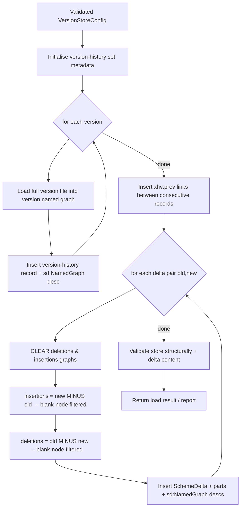

# EPIC: Rewrite the SKOS-History version-loading & delta-computation script in Python (RDF Loading Module)

> Shaped to its final agreed form. The original EPIC/PLAN that seeded this change are **superseded**
> by this `proposal.md` + `design.md` + `tasks.md`; the unique reference seeds (Gherkin, deep delta
> spec, synthesis, seed brief) remain under `inputs/`. Where the final decisions diverge from the
> legacy ADRs, `design.md` records the override explicitly.

## Appetite

**Large.** This is no longer a thin script port: the epic bundles the RDF Loading Module **plus** a
package-wide cleanup (full `rdf_differ/utils/` dissolution, stricter import-linter, migration of the
existing hand-written `rdf_differ/domain/model.py` to pydantic), and it takes on an **external
dependency** — the in-memory full-report path needs an eds4jinja2 enhancement shipped from its own
repo in a separate thread. The work is broken into reviewable TDD tasks (see `tasks.md`), landing
test-first, layer by layer, always green. The budget is bounded by a clean seam: the **remote core +
in-memory diff artifacts** always ship; the **in-memory full report** is gated on the eds4jinja2
release and degrades gracefully to remote-only if that release is absent — never forced, never
reworking the core. It lands as its own PR off `feature/rdf-loading-module`.

## Why

The legacy shell script `resources/load_versions.sh` (invoked via `subprocess` from
`rdf_differ/adapters/skos_history_wrapper.py`) is Bash + curl: untestable, with failures hidden by
`--silent ... > /dev/null`, free-string SPARQL interpolated from shell vars, non-idempotent delta
writes, hard-coded blank-node and dataset-specific rules, and a hard dependency on an external triple
store. It supports N versions but the wrapper only ever exercises two. We want a clean, layered,
fully testable Python implementation — and, critically, the ability to run a diff entirely in memory
without any server.

While we are in here, two adjacent debts make the rewrite both safer and cheaper to do **now** rather
than later: the legacy `rdf_differ/utils/` grab-bag (filesystem helpers, MIME types, name validation,
report-location helpers, RDF conversion, `strtobool`) violates the layering the new module must obey,
and the existing hand-written domain models (`Dataset`, `DatasetVersion`, `VersionsDelta`) carry no
validation. Folding the utils dissolution, a stricter import-linter, and a pydantic migration of the
domain into this epic lets the loading module land into a clean, contract-enforced package instead of
fighting the old one.

## Solution outline (Description)

The RDF Loading Module replaces the legacy shell script with a clean, layered, fully testable Python
implementation. The module loads two or more complete RDF vocabulary versions as named graphs,
computes triple-level **insertions** and **deletions** between version pairs (the *skos-history*
four-graph delta pattern), and materialises the version-history metadata that downstream tools
(`diff-query-generator`-produced queries, the report builder) rely on.

The single most important new capability is **dual-mode operation** behind a single `GraphStorePort`
interface with **three** config-selected implementations:

1. **Remote mode** (`RemoteSparqlStore`) — load and diff against **any SPARQL 1.1 endpoint** (Apache
   Jena Fuseki today, but not Fuseki-specific) via Graph Store Protocol `PUT` + SPARQL Update/Query
   over HTTP. This is the always-ships core, preserving current production behaviour.
2. **In-memory mode, oxigraph** (`PyoxigraphStore`) — load and diff entirely in-process via
   `pyoxigraph` (no triple store required).
3. **In-memory mode, rdflib** (`RdflibStore`) — the same, backed by `rdflib`, as a dependency-light
   reference engine.

Both in-memory engines exist and are selected by config/flag (`remote|oxigraph|rdflib`) — this
**overrides legacy ADR-2**, which chose pyoxigraph only. All three modes execute the **same**
delta-computation logic against the **same** named-graph contract, selected by dependency injection.
Services depend only on `GraphStorePort` (DIP) and never import `pyoxigraph`, `rdflib`, `requests`,
`SPARQLWrapper`, or `eds4jinja2` directly.

The in-memory side splits at a clean seam into two deliverables:

- **In-memory diff artifacts** — the four named graphs serialisable to files, plus insertion/deletion
  counts and validation. **No external dependency**; lands with the core.
- **In-memory full report** — depends on an **external, separately-shipped eds4jinja2 enhancement**
  (its own epic in the eds4jinja2 repo, implemented in a different thread). If that enhancement is
  absent, in-memory reporting **degrades gracefully** to remote-only with no rework of the core.

This EPIC owns **version loading + low-level delta-graph construction + version-history metadata**,
**plus** the utils dissolution, the stricter import-linter contracts, and the pydantic migration of
the domain. It does **not** own higher-level change-category reporting — that remains the
responsibility of the `diff-query-generator`-produced SPARQL queries and the existing report builder.
The contract between the two is the four named graphs plus the version-history graph (see Glossary).

## Glossary

| Term | Definition |
|------|------------|
| **Version graph** | A named graph holding the complete RDF snapshot of one vocabulary version. IRI: `{base}/{version_id}`. |
| **Version history set** | The `dsv:VersionHistorySet` resource describing one evolving vocabulary; IRI `{base}` = `{scheme_uri}/version`. |
| **Version history record** | A `dsv:VersionHistoryRecord` per version; IRI `{base}/record/{version_id}`. |
| **Scheme delta** | `skos-history:SchemeDelta` resource for one `(old → new)` transition; IRI `{base}/{old}/delta/{new}`. |
| **Insertions graph** | Named graph with `triples(new) − triples(old)`; component typed `skos-history:SchemeDeltaInsertions`. |
| **Deletions graph** | Named graph with `triples(old) − triples(new)`; component typed `skos-history:SchemeDeltaDeletions`. |
| **Named-graph contract** | The set `{version graphs, insertions graph, deletions graph, version-history graph}` plus their `sd:NamedGraph`/`sd:name` descriptions — the interface consumed by `diff-query-generator` queries. |
| **`GraphStorePort`** | The single secondary-adapter interface the loading service depends on; methods `put_graph`, `clear_graph`, `update`, `query`, `serialize`. Three implementations: `RemoteSparqlStore`, `PyoxigraphStore`, `RdflibStore`. |
| **Remote mode** | `GraphStorePort` backed by HTTP (SPARQL 1.1 Graph Store Protocol `PUT` + SPARQL Update/Query) against any SPARQL 1.1 endpoint (Fuseki today). The always-ships core. |
| **In-memory mode** | `GraphStorePort` backed by an in-process store; engine is config-selected — `PyoxigraphStore` or `RdflibStore`. |
| **In-memory diff artifacts** | The four named graphs serialisable to files + counts + validation; no external dependency. |
| **In-memory full report** | A full eds4jinja2-rendered report over the in-process store; depends on the external eds4jinja2 enhancement (graceful fallback to remote-only otherwise). |
| **eds4jinja2 enhancement** | An upstream eds4jinja2 release adding `ReportBuilder(external_data_source_builders=…)` + an engine-agnostic `InMemorySPARQLDataSource`; authored as its own epic in the eds4jinja2 repo. A dependency of this epic, not built here. |
| **Blank-node policy** | The rule deciding how blank nodes participate in deltas, via a pluggable `BlankNodeStrategy` (DEC-9). `exclude` (default — IRI subjects only; IRI/literal objects), `document-only` (no filter), `skolemise` (deterministic W3C `.well-known/genid/` IRIs via rdflib). |
| **Delta pair set** | The set of `(old, new)` version pairs deltas are computed for: consecutive pairs (required) plus optional direct-to-current pairs. |

## Algorithm / Flow



The same flow runs unchanged in all three modes; only the `GraphStorePort` implementation differs
(`RemoteSparqlStore`, `PyoxigraphStore`, or `RdflibStore`), selected by config/flag.

> Note: the legacy script computes `deletions` before `insertions` and swaps minuend/subtrahend
> (`load_versions.sh:245-258`). This module computes `insertions = new − old` first, then
> `deletions = old − new` — set-algebraically identical, reordered for readability and to pair
> each `CLEAR` with its `INSERT` (idempotency, L5). Not a behavioural change.

## Features present in `load_versions.sh` (inventory to preserve)

| # | Feature in the script | Where (script) | Must preserve? |
|---|-----------------------|----------------|----------------|
| F1 | Read a per-dataset `.config` file (DATASET, SCHEMEURI, VERSIONS[], BASEDIR, FILENAME, PUT_URI, UPDATE_URI, QUERY_URI, INPUT_MIME_TYPE) | `:29-57` | Yes — as a typed config model |
| F2 | Upload each version file via SPARQL Graph Store Protocol `PUT ?graph=` | `sparql_put` `:63-77`, `:103` | Yes |
| F3 | Build `BASEURI` from `SCHEMEURI` (+ `/version`, trailing-slash handling) | `:317-322` | Yes |
| F4 | Create SPARQL service description (`sd:Service`, `sd:Dataset`) | `:340-358` | Yes |
| F5 | Initialise version-history set with `dsv:currentVersionRecord` = latest | `:360-380` | Yes |
| F6 | Per-version record: `dsv:VersionHistoryRecord`, `dc:identifier`, `dc:date`, `sh:usingNamedGraph`→`sd:NamedGraph`→`sd:name` | `:122-171` | Yes |
| F7 | Extract identifier/date from the data (owl:versionInfo / dcterms:issued / dcterms:modified) with fallbacks | `:142-169` | Yes (config-driven, see L7) |
| F8 | `xhv:prev` chain between consecutive versions | `:414-424` | Yes |
| F9 | Delta computation via `INSERT { GRAPH delta } WHERE { GRAPH a MINUS GRAPH b }` | `:259-280` | Yes |
| F10 | Blank-node filter (`isIRI(?s)`, `isIRI/isLiteral/isNumeric(?o)`) | `:275-277` | Yes (configurable, L6) |
| F11 | Delta metadata: `SchemeDelta`, `deltaFrom/deltaTo`, `hasPart`/`isPartOf`, component `sd:NamedGraph` | `:228-296` | Yes |
| F12 | Two-pass execution (all versions first, then all deltas) to avoid overwrites | `:394-431` | Yes (preserve as ordering invariant) |
| F13 | Consecutive deltas **and** direct-to-current deltas | `:401-431` | Yes (configurable) |
| F14 | Dataset-specific date hacks (`VERSION_DATE_MISSING="agrovoc jel"`) | `:175-199` | Replace with config (L7) |
| F15 | Service-description `sd:namedGraph` registration for every graph | `:201-211`, `:298-308`, `:382-392` | Yes |

## Limitations of the script & how to overcome them

| # | Limitation | Impact | Remediation in this Epic |
|---|------------|--------|--------------------------|
| L1 | **Bash + curl**, untestable; failures hidden by `--silent ... > /dev/null` | Silent data corruption; no unit/BDD coverage | Pure-Python, layered, ≥80% coverage; explicit error matrix |
| L2 | **Hard dependency on an external triple store** | Cannot run a quick/local/CI diff; every diff needs Fuseki + admin creds | `GraphStorePort` + two in-memory adapters (`PyoxigraphStore`, `RdflibStore`); CLI in-memory mode (the core bet) |
| L3 | **Subprocess invocation** from Python (`Popen`) | OS/PATH brittleness, shebang reliance, opaque error surface | Eliminate subprocess; call Python service directly |
| L4 | **Free-string SPARQL** interpolated from shell vars (and `.replace('~description~')` in `diff_adapter.py`) | Injection surface, magic strings, fragile | Parametrised query templates as named constants; URIs built by a `UriBuilder`; values bound, not concatenated |
| L5 | **Non-idempotent deltas** — uses `INSERT` (not `CLEAR`+`INSERT`) for delta graphs | Stale triples accumulate on re-run | `CLEAR GRAPH` before each delta recompute; `PUT` for version graphs |
| L6 | **Blank-node policy hard-coded** | Cannot track skolemised/blank-node-sensitive vocabularies | Configurable `BlankNodePolicy` (exclude default; skolemise / document alternatives) |
| L7 | **Dataset-specific magic strings** (`agrovoc jel`) embedded in flow | Per-dataset edits to a shared script | Config-driven date/identifier resolution; no dataset names in code |
| L8 | **No post-load validation** | Corrupt/empty graphs pass silently | Structural + delta-content validation (SPARQL `ASK`s) per spec §10 |
| L9 | **Used for only 2 versions** by the wrapper, though the script supports N | Direct-to-current never exercised; latent bugs | First-class N-version support; delta-pair set computed and tested |
| L10 | **Service description lives in default graph** ambiguously | Discovery inconsistencies | Explicit metadata graph + `sd:NamedGraph` descriptions per spec §8.5 |

## Code of practice (constraints the implementation must honour)

- **Layering** (cosmic-python): `models/` (pure domain: config, URIs, version/delta value objects),
  `adapters/` (`GraphStorePort` + two implementations, query templates), `services/`
  (loading orchestration, validation), `entrypoints/` (CLI; reuse by the existing API/Celery path).
  Dependency direction `entrypoints → services → models`, `adapters → models`; **models import no framework**.
- **No free strings**: SPARQL templates, prefixes, graph roles, blank-node policies, and MIME types
  are constants/enums, not inline literals.
- **DIP at the store seam**: services depend only on `GraphStorePort`; never on `pyoxigraph`,
  `requests`, or `SPARQLWrapper` directly.
- **Tests first**: unit tests per layer + BDD features (the Gherkin is preserved in `inputs/`).
- **Idempotency**: re-running the pipeline yields equivalent graph state.
- **importlinter contracts** added to enforce the layering (none exist today).
- **Backward compatibility**: remote mode reproduces the current four-graph contract so
  `diff-query-generator` queries and the report builder keep working unchanged.

## Concrete Examples

**Input config (YAML, in-memory oxigraph engine):**
```yaml
dataset_id: stw
scheme_uri: http://zbw.eu/stw
base_version_iri: http://zbw.eu/stw/version
engine: oxigraph        # remote | oxigraph | rdflib
blank_node_policy: exclude
compute_direct_to_current: true
versions:
  - { id: "8.14", file: "data/stw-8.14.ttl", date: "2024-01-01" }
  - { id: "9.0",  file: "data/stw-9.0.ttl",  date: "2025-01-01" }
```

**CLI:**
```
rdf-diff load --config stw.yaml --engine oxigraph --out ./out          # in-memory diff artifacts
rdf-diff load --config stw.yaml --engine oxigraph --report --out ./out # + full report (gated on eds4jinja2)
rdf-diff load --config stw.yaml --engine remote                        # into a SPARQL endpoint
```

**Expected output (in-memory mode):** serialised named graphs + a machine-readable result:
```json
{
  "dataset_id": "stw",
  "current_version": "9.0",
  "delta_pairs": [["8.14","9.0"]],
  "counts": { "8.14->9.0": { "insertions": 142, "deletions": 87 } },
  "validation": "passed"
}
```

**Expected output (remote mode):** the four named graphs + version-history graph populated in
Fuseki, identical in structure to today's `load_versions.sh` output; `count_inserted_triples` /
`count_deleted_triples` queries return the same numbers.

## No-gos

Derived from the EPIC's "Anti-Patterns (DO NOT)" table, the module-boundary scope (ADR-4), and the
final agreed decisions.

| Don't | Do Instead | Why |
|-------|-----------|-----|
| Import `pyoxigraph`/`rdflib`/`requests`/`SPARQLWrapper`/`eds4jinja2` from `services/` | Depend on `GraphStorePort` | Keeps the three engines swappable (DIP); protects the core dual-mode bet (enforced by import-linter) |
| Build SPARQL by f-string-concatenating user values | Bind values / use named template constants + `UriBuilder` | Removes injection surface and magic strings (L4) |
| Keep `INSERT`-only delta writes | `CLEAR GRAPH` then `INSERT` | Guarantees idempotency (L5) |
| Re-introduce `subprocess`/`Popen` or shell out to curl | In-process Python calls | Removes OS/PATH brittleness (L1, L3) |
| Hard-code dataset names or blank-node rules in flow | Drive from `VersionStoreConfig` / `BlankNodePolicy` enum | No per-dataset code edits (L6, L7) |
| Assume exactly two versions | Support the computed delta-pair set (N versions) | Direct-to-current correctness (L9) |
| Skip post-load validation | Run structural + content `ASK` checks | Fail fast on corrupt graphs (L8) |
| Put report/change-category logic here | Leave it to dqgen queries + report builder | Preserve module boundary (ADR-4) |
| Adopt **FastAPI** | Keep Flask/Connexion; UI unchanged | Out of scope; no framework churn |
| Introduce **LinkML** / generate the domain | Hand-write pydantic v2 models | Out of scope; DEC-3 chooses hand-written pydantic |
| Edit `diff-query-generator` templates | Preserve the four-graph contract so generated queries keep working | dqgen is a build-time generator, not ours to fork (ADR-4) |
| Fork or vendor **eds4jinja2** inside rdf-differ for in-memory reporting | Depend on its upstream release; fall back to remote-only if absent | DEC-5 — the enhancement is its own epic in the eds4jinja2 repo |

**Out of scope (module boundary, ADR-4):** higher-level change-category reporting stays in the
`diff-query-generator`-produced SPARQL queries and the existing report builder. This module produces
only the four named graphs + version-history graph and the triple-level deltas. `SKOLEMISE`
blank-node handling **is supported in this epic** (DEC-9, overriding the legacy ADR-5 "future" note):
a pluggable `BlankNodeStrategy` seam with an initial **KISS, deterministic, W3C-compliant** rdflib
implementation (`to_canonical_graph` → `skolemize` to `.well-known/genid/` IRIs), built to be improved
later behind the same interface. **Not in this epic:** FastAPI (Flask stays, UI unchanged), LinkML/code
generation, editing dqgen templates, and building the eds4jinja2 enhancement itself (depended upon,
not built here).

## Test Case Specifications

| Test ID | Component | Input | Expected Output | Edge Cases |
|---------|-----------|-------|-----------------|------------|
| T1 | Config validation (models) | Config with 1 version | `ConfigError` "≥2 versions required for deltas" | 0 versions; duplicate ids; missing file; relative IRI |
| T2 | `UriBuilder` (models) | base `…/stw/version`, ids `8.14`,`9.0` | Correct version/record/delta/component IRIs; version ids percent-encoded | id with space/slash; trailing slash on base |
| T3 | Delta computation (services + in-memory adapter) | old graph O, new graph N | insertions = N−O, deletions = O−N; blank nodes excluded | identical versions → empty deltas; only-bnode changes → empty |
| T4 | Delta-pair set (models) | `[8.12,8.13,8.14,9.0]`, direct-to-current on | consecutive + `8.12→9.0`, `8.13→9.0` (no dup of penultimate) | 2 versions → single pair, no direct-to-current |
| T5 | Idempotency (services) | run pipeline twice | identical graph state & counts | partial prior run leaves stale delta triples → cleared |
| T6 | Mode parity (services) | same config in both modes | identical counts & named-graph contract | large graph; remote endpoint error → `GraphStoreError` |
| T7 | Store validation (services) | store with empty version graph | `ValidationError` non-empty graph expected | invalid insertion triple present |
| T8 | Remote adapter (adapters) | GSP PUT + SPARQL Update | correct HTTP verbs/bodies (mocked) | 4xx/5xx → `GraphStoreError`; timeout |

## Error Handling Matrix

| Error Type | Detection | Response | Fallback |
|------------|-----------|----------|----------|
| Missing/unreadable version file | Config validation (pre-flight) | `ConfigError`, abort before any write | none — fail fast |
| `<2` versions or duplicate ids | Config validation | `ConfigError` | none |
| Non-absolute `scheme_uri`/`base_version_iri` | Config validation | `ConfigError` | none |
| Mixed/unknown RDF serialisation | Format check on load | `UnsupportedFormatError` | none |
| RDF parse failure | Load step (adapter) | `GraphLoadError`, abort pipeline | none |
| Remote HTTP failure (PUT/Update/Query) | Remote adapter status check (≥400) | `GraphStoreError` with status + body; log at ERROR | retry 3× with exponential backoff (base 1s) on transient (timeout/5xx), configurable via `retry_attempts`/`retry_base_seconds`; then abort |
| Empty graph expected non-empty | Post-load validation | `ValidationError` naming the graph; log at ERROR | none |
| Invalid delta triple (content check) | Validation `ASK` | `ValidationError` listing offending graph; log at ERROR | none |
| In-memory load above size threshold | Pre-flight: combined input size > `in_memory_max_mb` (default 512) | log WARNING advising remote or RocksDB-backed store | proceed (warning only); user may re-run in remote mode |

### User-facing errors (CLI surface)

The CLI prints the raised exception's message verbatim and exits non-zero; no stack trace for known errors.

| Exception | Exit code | CLI message shape | Recovery |
|-----------|-----------|-------------------|----------|
| `ConfigError` | 2 | `config error: <reason>` | fix the YAML config and re-run |
| `UnsupportedFormatError` | 2 | `unsupported RDF format: <file>` | convert/declare a supported serialisation |
| `GraphLoadError` | 3 | `failed to load <version>: <detail>` | fix the source file |
| `GraphStoreError` | 4 | `triple store error: <status> <detail>` | check endpoint/credentials; retry |
| `ValidationError` | 5 | `validation failed: <graph> <reason>` | inspect inputs; re-run |
| unexpected | 1 | `unexpected error` + stack trace | report a bug |

## Impact

- **Code:** new module under `rdf_differ/{domain,adapters,services,entrypoints}/loading/`; rewires
  `FusekiDiffAdapter.create_diff`; retires `resources/load_versions.sh` and the subprocess path in
  `rdf_differ/adapters/skos_history_wrapper.py`. **Dissolves `rdf_differ/utils/`** into the right
  layers (see `design.md` dissolution map) and updates its consumers (incl. `tests/steps/*.py` and
  `services/report_handling.py`). **Migrates `rdf_differ/domain/model.py`** (`Dataset`,
  `DatasetVersion`, `VersionsDelta`) to pydantic v2.
- **APIs:** the HTTP/CLI surface gains a `load` CLI (`--engine remote|oxigraph|rdflib [--report]`);
  the existing API create-diff endpoint gains an `engine`/`mode` parameter and runs async over the
  existing Celery+Redis channel (status + revoke/cancel queue in `adapters/redis.py`). The existing
  diff flow is preserved via `RemoteSparqlStore` (four-graph contract unchanged).
- **Dependencies:** add `pyoxigraph` (in-memory store) and `import-linter` (contracts); `rdflib` is
  already present (second in-memory engine). **External dependency:** the eds4jinja2 enhancement for
  the in-memory full report (separate epic/release; graceful fallback if absent).
- **Architecture:** stricter import-linter — keep the (now utils-free) layers contract; add a
  forbidden contract barring `services` from store/report libs, a forbidden contract barring `domain`
  from I/O frameworks, and an independence contract between the three store adapters.
- **Out of scope / parked:** higher-level change-category reporting (dqgen + report builder); FastAPI;
  LinkML; building the eds4jinja2 enhancement itself.

## References

- Legacy script: `resources/load_versions.sh:91-311` (load_version, load_delta), `:394-431` (two-pass)
- Current wrapper: `rdf_differ/adapters/skos_history_wrapper.py:42-227` (`SKOSHistoryRunner`), `:192-213` (`execute_subprocess`)
- Triple-store adapter: `rdf_differ/adapters/diff_adapter.py:117-305` (`FusekiDiffAdapter`)
- SPARQL templates/prefixes: `rdf_differ/adapters/__init__.py:9-118`
- Config: `rdf_differ/config.py:32-37` (Fuseki), `:17` (filename)
- Deep spec: `inputs/delta_graphs_loading_and_computation_spec.md` §7 (delta rules), §8 (process), §10 (validation)
- Synthesis: `inputs/on-using-version-graphs-synthesis.md`
- Plan: this change's `design.md` (decisions) + `tasks.md` (TDD task checklist)
- Gherkin: `inputs/rdf_loading_module.feature`
- Seed brief: `inputs/EPIC-analyse-how-torewrite-sh-to-python.md`
